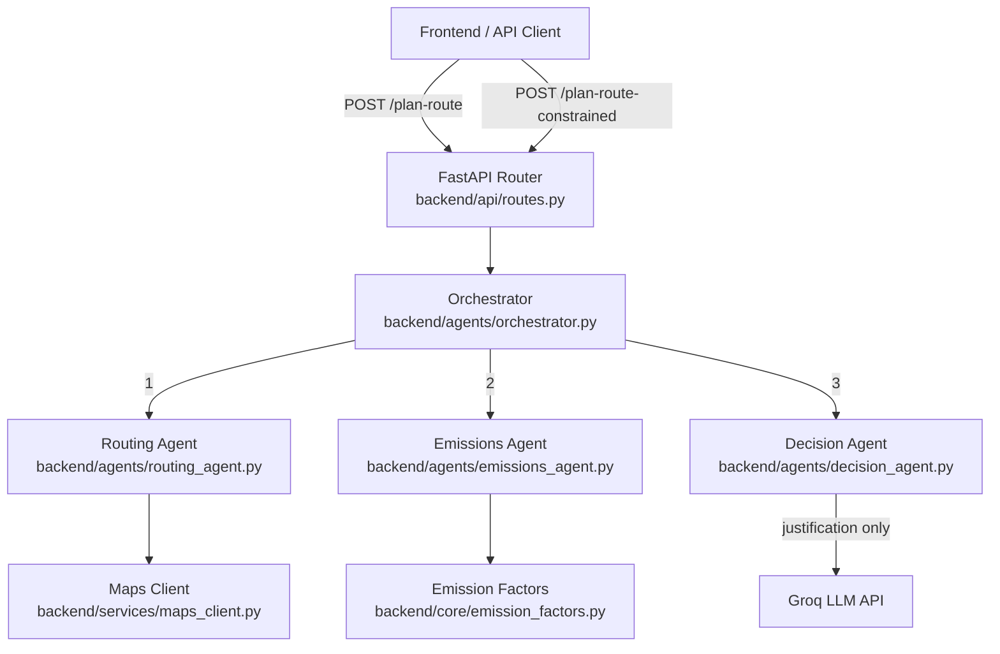
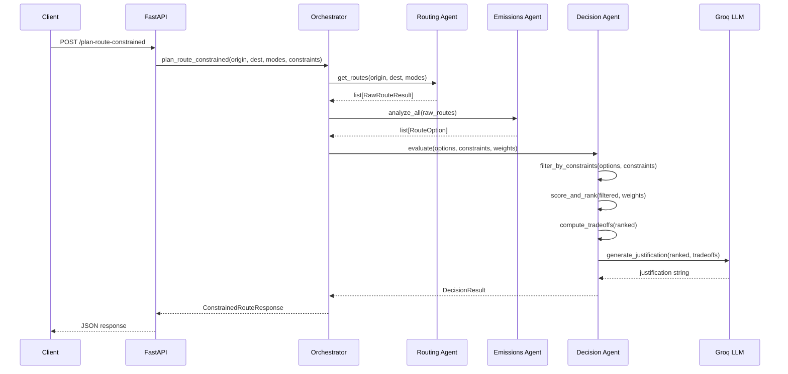
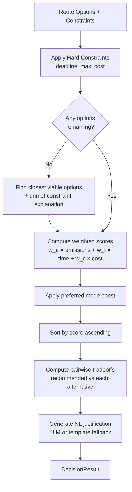

# Design: Agentic Reasoning Layer (Phase 1.2)

## Overview

Phase 1.2 adds constraint-aware decision-making and structured tradeoff analysis to the PathProject route planner. It introduces three new capabilities on top of the Phase 1.1 foundation:

1. **Decision Agent constraint evaluation** — a deterministic scoring and filtering engine that applies user constraints (arrival deadline, max cost, preferred modes) to rank route options using weighted scoring, without relying on an LLM for the core logic.
2. **Tradeoff analysis** — structured pairwise comparisons between the recommended route and every alternative, quantifying differences in emissions, time, and cost, with natural language justification generation.
3. **Orchestrator formalization** — the existing orchestrator is extended to support the constrained pipeline, passing structured `UserConstraint` objects through the Routing → Emissions → Decision flow.

A new `POST /api/v1/plan-route-constrained` endpoint exposes the full constrained pipeline. The existing `/plan-route` endpoint continues to work unchanged (the orchestrator detects the absence of constraints and behaves identically to Phase 1.1).

### Design Decisions

- **Deterministic scoring over LLM-only reasoning**: The Decision Agent uses a weighted scoring formula for ranking and filtering. The LLM (Groq/Llama) is used only for generating the natural language justification string, not for the ranking decision itself. This makes the core logic testable, reproducible, and fast. The LLM call is optional — the system falls back to template-based justification if the LLM is unavailable.
- **Constraint filtering before scoring**: Hard constraints (deadline, max cost) are applied as filters first, removing ineligible options. Soft constraints (preferred modes) are applied as scoring boosts. This two-phase approach ensures hard constraints are never violated.
- **Graceful degradation on empty filter results**: If all options are eliminated by hard constraints, the Decision Agent returns the "closest viable" options (sorted by how close they are to satisfying constraints) with an explanation of which constraints could not be met.
- **Additive new endpoint**: The new `/plan-route-constrained` endpoint is separate from `/plan-route` to avoid breaking existing clients. When called with no constraints, it delegates to the same pipeline as `/plan-route`.

## Architecture

The architecture extends the Phase 1.1 linear pipeline with constraint-aware decision logic:



### Constrained Request Flow



### Decision Agent Internal Flow



## Components and Interfaces

### 1. Decision Agent (`backend/agents/decision_agent.py`)

The existing decision agent is refactored to separate deterministic logic from LLM interaction.

**New public functions:**

```python
def filter_by_constraints(
    options: list[RouteOption],
    constraints: list[UserConstraint],
) -> tuple[list[RouteOption], list[str]]:
    """
    Apply hard constraints (arrival_by, max_cost) as filters.
    Returns (filtered_options, list_of_unmet_constraint_descriptions).
    If all options are eliminated, returns closest viable options instead.
    """

def compute_weighted_score(
    option: RouteOption,
    weights: ScoreWeights,
    preferred_modes: list[TransitMode] | None = None,
) -> float:
    """
    Compute a single scalar score for a route option.
    Lower is better. Formula:
      score = w_emissions * normalized_emissions
            + w_time * normalized_time
            + w_cost * normalized_cost
            - preferred_mode_boost (if mode in preferred_modes)
    """

def rank_options(
    options: list[RouteOption],
    weights: ScoreWeights,
    preferred_modes: list[TransitMode] | None = None,
) -> list[ScoredRouteOption]:
    """
    Score and sort options by weighted score (ascending = best first).
    Returns options annotated with their scores.
    """

def compute_tradeoffs(
    ranked: list[ScoredRouteOption],
) -> list[TradeoffSummary]:
    """
    Compare the top-ranked option against every alternative.
    Returns N-1 TradeoffSummary objects for N options.
    """

def build_justification(
    recommended: RouteOption,
    tradeoffs: list[TradeoffSummary],
    unmet_constraints: list[str],
) -> str:
    """
    Build a deterministic natural language justification string.
    Template-based fallback that always works without LLM.
    """

async def evaluate(
    origin: str,
    destination: str,
    options: list[RouteOption],
    constraints: list[UserConstraint] | None = None,
    weights: ScoreWeights | None = None,
    api_key: str = "",
) -> DecisionResult:
    """
    Full decision pipeline: filter → score → rank → tradeoffs → justify.
    Uses LLM for justification if api_key is available, otherwise template.
    """
```

**Existing function (preserved for backward compatibility):**

```python
async def decide(
    origin: str,
    destination: str,
    options: list[RouteOption],
    constraint: str | None = None,
    api_key: str = "",
) -> AgentReasoning:
    """Existing LLM-based reasoning (Phase 1.1 compatibility)."""
```

### 2. Orchestrator (`backend/agents/orchestrator.py`)

The existing `plan_route` function is preserved. A new `plan_route_constrained` function is added.

**New public function:**

```python
async def plan_route_constrained(
    origin: str,
    destination: str,
    modes: list[TransitMode] | None = None,
    constraints: list[UserConstraint] | None = None,
    weights: ScoreWeights | None = None,
    routing_mode: str = "mock",
    google_maps_api_key: str = "",
    groq_api_key: str = "",
) -> ConstrainedRouteResponse:
    """
    Run the constrained agent pipeline:
      1. Routing Agent → fetch routes
      2. Emissions Agent → compute emissions/costs
      3. Decision Agent → filter, score, rank, tradeoff, justify
    
    If constraints is None or empty, behaves identically to plan_route
    but returns the ConstrainedRouteResponse shape.
    """
```

**Existing function (unchanged):**

```python
async def plan_route(...) -> RouteComparison:
    """Existing unconstrained pipeline (Phase 1.1)."""
```

### 3. API Layer (`backend/api/routes.py`)

**New endpoint:**

```python
@router.post("/plan-route-constrained", response_model=ConstrainedRouteResponse)
async def plan_route_constrained(
    req: ConstrainedRouteRequest,
    settings: Settings = Depends(get_settings),
) -> ConstrainedRouteResponse:
    """
    Constrained route planning with user constraints and weighted scoring.
    """
```

**Existing endpoint (unchanged):**

```python
@router.post("/plan-route", response_model=RouteComparison)
async def plan_route(req: RouteRequest, ...) -> RouteComparison:
    """Existing unconstrained endpoint (Phase 1.1)."""
```

### 4. Schemas (`backend/models/schemas.py`)

New Pydantic models are added alongside existing ones. No existing models are modified.

## Data Models

### Existing Models (unchanged)

```python
class RouteRequest(BaseModel):
    origin: str
    destination: str
    modes: list[TransitMode] | None = None
    constraint: str | None = None

class RouteSegment(BaseModel): ...   # unchanged
class RouteOption(BaseModel): ...    # unchanged
class AgentReasoning(BaseModel): ... # unchanged
class RouteComparison(BaseModel): ... # unchanged
```

### New Models

```python
class UserConstraint(BaseModel):
    """A single user constraint for route filtering."""
    constraint_type: Literal["arrival_by", "max_cost", "preferred_modes"]
    arrival_by: datetime | None = Field(
        default=None,
        description="Deadline timestamp. Options exceeding the time window are excluded.",
    )
    max_cost: float | None = Field(
        default=None,
        description="Maximum acceptable cost in USD.",
    )
    preferred_modes: list[TransitMode] | None = Field(
        default=None,
        description="Modes to prioritize in ranking (soft constraint).",
    )


class ScoreWeights(BaseModel):
    """Weights for the multi-criteria scoring function. Must sum to 1.0."""
    emissions: float = Field(default=0.4, ge=0.0, le=1.0)
    time: float = Field(default=0.35, ge=0.0, le=1.0)
    cost: float = Field(default=0.25, ge=0.0, le=1.0)


class ConstrainedRouteRequest(BaseModel):
    """Request model for the constrained route planning endpoint."""
    origin: str = Field(..., description="Starting address or lat,lng")
    destination: str = Field(..., description="Ending address or lat,lng")
    modes: list[TransitMode] | None = Field(
        default=None,
        description="Transit modes to evaluate. None = all available.",
    )
    constraints: list[UserConstraint] | None = Field(
        default=None,
        description="User constraints for filtering and ranking.",
    )
    weights: ScoreWeights | None = Field(
        default=None,
        description="Custom scoring weights. Defaults to emissions=0.4, time=0.35, cost=0.25.",
    )
    departure_time: datetime | None = Field(
        default=None,
        description="Departure time. Required when arrival_by constraint is used.",
    )


class TradeoffSummary(BaseModel):
    """Pairwise comparison between the recommended route and an alternative."""
    alternative_mode: TransitMode
    emissions_diff_kg: float = Field(
        description="Emissions difference in kg CO2e (positive = recommended saves emissions).",
    )
    duration_diff_min: float = Field(
        description="Duration difference in minutes (positive = recommended is slower).",
    )
    cost_diff_usd: float = Field(
        description="Cost difference in USD (positive = recommended is cheaper).",
    )
    summary: str = Field(
        description="One-line natural language comparison (e.g., 'saves 3.2 kg CO2 for a 4-min longer trip').",
    )


class ScoredRouteOption(BaseModel):
    """A RouteOption annotated with its weighted score."""
    option: RouteOption
    score: float = Field(description="Weighted score (lower is better).")
    rank: int = Field(description="1-based rank position.")


class DecisionResult(BaseModel):
    """Full output of the Decision Agent."""
    ranked_options: list[ScoredRouteOption]
    recommended: RouteOption
    tradeoffs: list[TradeoffSummary]
    justification: str = Field(
        description="Natural language justification for the recommendation.",
    )
    unmet_constraints: list[str] = Field(
        default_factory=list,
        description="Descriptions of constraints that could not be fully satisfied.",
    )


class ConstrainedRouteResponse(BaseModel):
    """Response model for the constrained route planning endpoint."""
    origin: str
    destination: str
    options: list[RouteOption]
    ranked_options: list[ScoredRouteOption]
    recommended: RouteOption | None = None
    greenest: RouteOption | None = None
    fastest: RouteOption | None = None
    cheapest: RouteOption | None = None
    savings_vs_driving_kg: float | None = None
    tradeoffs: list[TradeoffSummary] = Field(default_factory=list)
    justification: str | None = None
    unmet_constraints: list[str] = Field(default_factory=list)
```

### Scoring Formula

The weighted score for a route option is computed using min-max normalization across the option set:

```
normalized_emissions = (option.emissions_g - min_emissions) / (max_emissions - min_emissions + ε)
normalized_time      = (option.duration_min - min_time) / (max_time - min_time + ε)
normalized_cost      = (option.cost_usd - min_cost) / (max_cost - min_cost + ε)

score = w_emissions × normalized_emissions
      + w_time × normalized_time
      + w_cost × normalized_cost
      - preferred_mode_boost   (0.1 if mode in preferred_modes, else 0)
```

Where `ε = 1e-9` prevents division by zero when all options have the same value for a dimension. Lower score = better option.

### Tradeoff Computation

For the recommended option `R` and each alternative `A`:

```
emissions_diff_kg = (A.total_emissions_kg - R.total_emissions_kg)   # positive = R saves
duration_diff_min = (R.total_duration_min - A.total_duration_min)   # positive = R is slower
cost_diff_usd     = (A.total_cost_usd - R.total_cost_usd)          # positive = R is cheaper
```

### Constraint Filtering Logic

**Arrival deadline**: Given `departure_time` and `arrival_by`, compute `available_minutes = (arrival_by - departure_time).total_seconds() / 60`. Exclude options where `total_duration_min > available_minutes`.

**Max cost**: Exclude options where `total_cost_usd > max_cost`.

**Preferred modes**: Not a filter — applied as a scoring boost of 0.1 to preferred modes.

**Fallback when all filtered out**: Sort eliminated options by number of violated constraints (ascending), then by smallest violation margin. Return top options with `unmet_constraints` populated.

## Correctness Properties

*A property is a characteristic or behavior that should hold true across all valid executions of a system — essentially, a formal statement about what the system should do. Properties serve as the bridge between human-readable specifications and machine-verifiable correctness guarantees.*

### Property 1: Hard constraint filtering correctness

*For any* list of `RouteOption` objects and *any* combination of hard constraints (arrival deadline with departure time, and/or max cost), every option in the filtered result SHALL satisfy all provided constraints: `total_duration_min <= available_minutes` (when deadline is set) AND `total_cost_usd <= max_cost` (when cost limit is set). Furthermore, no option that satisfies all constraints SHALL be absent from the result.

**Validates: Requirements 1.1, 1.2, 1.4**

### Property 2: Preferred mode scoring boost

*For any* two `RouteOption` objects with identical emissions, duration, and cost values, where one uses a preferred mode and the other does not, the preferred-mode option SHALL receive a strictly lower (better) weighted score than the non-preferred option.

**Validates: Requirements 1.3**

### Property 3: Weighted score ranking consistency

*For any* non-empty list of `RouteOption` objects and *any* valid `ScoreWeights`, the `rank_options` function SHALL return options sorted by weighted score in ascending order, and each option's `score` field SHALL equal the value computed by the scoring formula.

**Validates: Requirements 1.6**

### Property 4: Tradeoff summary count

*For any* list of N ranked `ScoredRouteOption` objects where N ≥ 1, `compute_tradeoffs` SHALL return exactly N-1 `TradeoffSummary` objects, one for each non-recommended option.

**Validates: Requirements 2.1**

### Property 5: Tradeoff difference arithmetic

*For any* two `RouteOption` objects R (recommended) and A (alternative), the `TradeoffSummary` SHALL satisfy: `emissions_diff_kg == A.total_emissions_kg - R.total_emissions_kg`, `duration_diff_min == R.total_duration_min - A.total_duration_min`, and `cost_diff_usd == A.total_cost_usd - R.total_cost_usd` (within floating-point tolerance).

**Validates: Requirements 2.2**

### Property 6: Justification content invariant

*For any* non-empty set of route options, the generated justification string SHALL be non-empty and contain at least one numeric value corresponding to a computed tradeoff difference. Additionally, when the recommended route has a higher duration than any alternative, the justification SHALL reference the time penalty.

**Validates: Requirements 2.3, 2.4, 2.5**

### Property 7: Emissions-to-options cardinality

*For any* list of N `RawRouteResult` objects, `analyze_all` SHALL return exactly N `RouteOption` objects.

**Validates: Requirements 3.2**

### Property 8: No-constraint equivalence

*For any* origin, destination, and mode set, calling the constrained pipeline with no constraints SHALL produce the same set of route options (same modes, same emissions, same costs, same durations) as the unconstrained pipeline.

**Validates: Requirements 4.5**

## Error Handling

### Existing Error Handling (from Phase 1.1, unchanged)

| Scenario | Behavior |
|---|---|
| Google Maps API failure | Falls back to mock routing |
| Missing Groq API key | Falls back to deterministic template-based justification |
| Unknown segment mode string | Falls back to `TransitMode.WALKING` emissions |

### New Error Handling (Phase 1.2)

| Scenario | Behavior | Requirement |
|---|---|---|
| All options filtered out by constraints | Return closest viable options + `unmet_constraints` list explaining which constraints failed | Req 1.5 |
| `arrival_by` constraint without `departure_time` | Return HTTP 422 with validation error: "departure_time is required when arrival_by constraint is used" | Req 4.2 |
| `max_cost` is negative | Return HTTP 422 with validation error: "max_cost must be non-negative" | Req 4.3 |
| `ScoreWeights` don't sum to ~1.0 | Normalize weights automatically (divide each by sum) rather than rejecting | Req 1.6 |
| Empty route options from Routing Agent | Return `ConstrainedRouteResponse` with empty lists and `justification = "No routes found between the specified locations."` | Req 3.4 |
| LLM justification call fails | Fall back to template-based `build_justification` — always produces a valid string | Req 2.3 |
| Invalid `constraint_type` value | HTTP 422 via Pydantic `Literal` validation | Req 4.1 |

### Validation Rules

```python
# On ConstrainedRouteRequest
@model_validator(mode="after")
def validate_arrival_constraint(self) -> Self:
    """Ensure departure_time is present when arrival_by is used."""
    if self.constraints:
        has_arrival = any(c.constraint_type == "arrival_by" for c in self.constraints)
        if has_arrival and self.departure_time is None:
            raise ValueError("departure_time is required when arrival_by constraint is used")
    return self

# On UserConstraint
@model_validator(mode="after")
def validate_constraint_fields(self) -> Self:
    """Ensure the correct field is populated for the constraint type."""
    if self.constraint_type == "arrival_by" and self.arrival_by is None:
        raise ValueError("arrival_by field is required for arrival_by constraint")
    if self.constraint_type == "max_cost" and self.max_cost is None:
        raise ValueError("max_cost field is required for max_cost constraint")
    if self.constraint_type == "preferred_modes" and not self.preferred_modes:
        raise ValueError("preferred_modes field is required for preferred_modes constraint")
    return self
```

## Testing Strategy

### Property-Based Testing

This feature is well-suited for property-based testing. The Decision Agent's core functions (`filter_by_constraints`, `compute_weighted_score`, `rank_options`, `compute_tradeoffs`, `build_justification`) are pure functions with clear input/output behavior and universal properties across a wide input space.

**Library**: [Hypothesis](https://hypothesis.readthedocs.io/) for Python

**Configuration**: Minimum 100 iterations per property test.

**Tag format**: `Feature: agentic-reasoning-layer, Property {number}: {property_text}`

Each correctness property (1–8) maps to one property-based test. Generators will produce:
- Random `RouteOption` objects with valid positive values for emissions, duration, cost
- Random `UserConstraint` objects with valid deadline timestamps and cost limits
- Random `ScoreWeights` with values summing to 1.0
- Random `TransitMode` selections for preferred modes
- Random lists of `RawRouteResult` objects for cardinality tests

### Unit Tests (Example-Based)

| Test | Requirement | Description |
|---|---|---|
| Arrival deadline filters correctly | Req 1.1 | Provide 3 options, one exceeding deadline. Verify it's excluded. |
| Max cost filters correctly | Req 1.2 | Provide 3 options, one exceeding budget. Verify it's excluded. |
| All options filtered — fallback | Req 1.5 | All options violate constraints. Verify closest viable returned with explanation. |
| Default weights applied | Req 1.6 | No custom weights. Verify defaults (0.4, 0.35, 0.25) are used. |
| Time penalty in justification | Req 2.4 | Recommended is slower. Verify justification mentions time difference. |
| Empty routes from Routing Agent | Req 3.4 | Mock empty route list. Verify empty response with message. |
| New endpoint returns 200 | Req 4.1 | POST /plan-route-constrained with valid body. Verify 200. |
| Missing departure_time with arrival_by | Req 4.2 | Omit departure_time. Verify 422. |
| Negative max_cost rejected | Req 4.3 | Send max_cost=-5. Verify 422. |
| Response shape validation | Req 4.4 | Verify response contains ranked_options, recommended, justification. |
| No constraints = same as plan-route | Req 4.5 | Call both endpoints, compare option sets. |

### Integration Tests

| Test | Requirement | Description |
|---|---|---|
| Full constrained pipeline (mock) | Req 3.1 | POST /plan-route-constrained with constraints. Verify full response shape and pipeline order. |
| Pipeline data integrity | Req 3.3 | Verify all emissions agent outputs reach decision agent. |
| LLM justification integration | Req 2.3 | (CI-only with Groq key) Verify LLM produces valid justification. |

### Test Organization

```
backend/
  tests/
    test_decision_agent.py      # Properties 1-6, constraint filtering, scoring, tradeoffs
    test_orchestrator.py        # Properties 7-8, pipeline cardinality, no-constraint equivalence
    test_constrained_api.py     # Unit tests for /plan-route-constrained endpoint
    test_integration.py         # Integration tests for full pipeline
```
