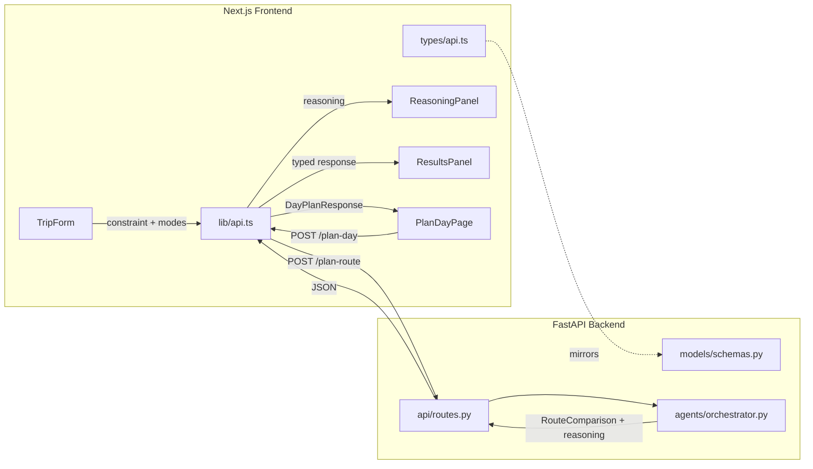

# Design Document: Backend-Frontend Integration

## Overview

This design integrates the PathProject FastAPI backend with the Next.js frontend by resolving all identified type mismatches, adding missing API client functions, creating new UI components, and establishing structured error handling. The integration covers nine conflict areas (C1–C5, C7–C10; C6 is deferred) to achieve end-to-end data flow correctness.

The approach is additive — we extend existing files (`api.ts`, `types/api.ts`) and add new components/pages rather than restructuring the codebase. The Next.js rewrite proxy in `next.config.js` already forwards `/api/v1/*` to the FastAPI backend, so no proxy changes are needed.

### Key Design Decisions

1. **Type-first approach**: Mirror all backend Pydantic models in `frontend/src/types/api.ts` before touching components or API client. This catches mismatches at compile time.
2. **Single API client module**: All new fetch functions go into `frontend/src/lib/api.ts` alongside the existing `planRoute`. A shared error-handling helper standardizes response parsing.
3. **ReasoningPanel as a standalone component**: Decoupled from ResultsPanel so it can be reused and tested independently.
4. **Plan Day as a Next.js route**: `/plan-day` page under `src/app/plan-day/page.tsx`, accessible from the sidebar nav.
5. **Backend OAuth endpoints remain stubs**: The frontend auth flow is fully built against the contract, but backend `/auth/google` and `/auth/callback` contain only boilerplate returning placeholder responses.
6. **Web Speech API for voice input**: Uses the browser-native `SpeechRecognition` API (Chrome/Edge) with a graceful fallback that hides the mic button on unsupported browsers.

## Architecture



### Data Flow

1. **Route Planning**: `TripForm` collects origin, destination, modes, and optional constraint → `planRoute()` POSTs to `/api/v1/plan-route` → backend orchestrator runs agent pipeline → returns `RouteComparison` with `reasoning` → `ResultsPanel` renders routes, `ReasoningPanel` renders agent output.
2. **Day Planning**: `PlanDayPage` collects date, home address, optional session_id → `planDay()` POSTs to `/api/v1/plan-day` → backend fetches calendar events and routes each transit window → returns `DayPlanResponse` → page renders events, transit windows, and totals.
3. **Factor Data**: `getEmissionFactors()` and `getCostFactors()` GET from `/api/v1/emission-factors` and `/api/v1/cost-factors` → return typed arrays for charts/reference.
4. **Auth Flow**: `getAuthUrl()` GETs `/api/v1/auth/google` → frontend redirects user to Google → callback returns `session_id` → stored in state for `planDay()` calls.

## Components and Interfaces

### Modified Files

#### `frontend/src/types/api.ts` — Type Definitions

Add the following interfaces to mirror backend Pydantic models:

| Interface | Fields | Source |
|---|---|---|
| `AgentReasoning` | `recommended_mode: TransitMode`, `summary: string`, `justification: string`, `constraint_analysis: string \| null` | `backend/models/schemas.py::AgentReasoning` |
| `CalendarEvent` | `summary: string`, `location: string`, `start: string`, `end: string` | `backend/models/schemas.py::CalendarEvent` |
| `TransitRecommendation` | `mode: TransitMode`, `duration_min: number`, `emissions_g: number`, `cost_usd: number`, `summary: string` | `backend/models/schemas.py::TransitRecommendation` |
| `TransitWindow` | `from_event: string`, `to_event: string`, `origin: string`, `destination: string`, `depart_after: string`, `arrive_by: string`, `available_min: number`, `recommended: TransitRecommendation`, `route: RouteComparison` | `backend/models/schemas.py::TransitWindow` |
| `DayPlanRequest` | `date: string`, `session_id: string \| null`, `home_address: string` | `backend/models/schemas.py::DayPlanRequest` |
| `DayPlanResponse` | `date: string`, `events: CalendarEvent[]`, `transit_windows: TransitWindow[]`, `total_emissions_g: number`, `total_cost_usd: number`, `total_transit_min: number` | `backend/models/schemas.py::DayPlanResponse` |
| `AuthUrlResponse` | `auth_url: string`, `state: string` | `backend/models/schemas.py::AuthUrlResponse` |
| `AuthCallbackResponse` | `session_id: string`, `message: string` | `backend/models/schemas.py::AuthCallbackResponse` |
| `ErrorResponse` | `status_code: number`, `message: string`, `detail: string \| null`, `errors: ValidationErrorDetail[] \| null` | New structured error format |
| `ValidationErrorDetail` | `field: string`, `reason: string` | New structured error format |
| `EmissionFactorResponse` | `mode: string`, `g_co2e_per_pkm: number`, `source: string`, `notes: string` | `backend/core/emission_factors.py::EmissionFactor` |
| `CostFactorResponse` | `mode: string`, `base_fare: number`, `per_km_cost: number`, `source: string`, `notes: string` | `backend/core/emission_factors.py::CostFactor` |

Update existing `RouteComparison` interface to add: `reasoning: AgentReasoning | null`.

#### `frontend/src/lib/api.ts` — API Client

Add a shared error-handling helper and new functions:

```typescript
// Shared error handler
async function handleApiError(res: Response): Promise<never> {
  // Attempt to parse as structured ErrorResponse
  // Fall back to raw text if JSON parsing fails
}

// Updated
export async function planRoute(
  origin: string,
  destination: string,
  modes: TransitMode[] | null,
  constraint?: string | null  // NEW parameter
): Promise<RouteComparison>

// New functions
export async function planDay(req: DayPlanRequest): Promise<DayPlanResponse>
export async function getAuthUrl(): Promise<AuthUrlResponse>
export async function getEmissionFactors(): Promise<EmissionFactorResponse[]>
export async function getCostFactors(): Promise<CostFactorResponse[]>
```

### New Files

#### `frontend/src/components/ReasoningPanel.tsx`

A component with two visual states:

1. **In-process state**: Animated loading indicator (pulsing icon + "Agent is reasoning…" text) shown while the API call is in flight.
2. **Complete state**: Displays `recommended_mode`, `summary` in a compact card. An expand toggle reveals `justification` and `constraint_analysis` (if non-null).
3. **Hidden state**: Does not render when `reasoning` is `null`.

Props interface:
```typescript
interface ReasoningPanelProps {
  reasoning: AgentReasoning | null;
  loading: boolean;
}
```

#### `frontend/src/app/plan-day/page.tsx`

A new page with:
- Date input (type="date")
- Home address text input
- Optional "Connect Google Calendar" button (triggers OAuth flow via `getAuthUrl()`)
- Submit button that calls `planDay()`
- Results area showing: event timeline, transit windows with recommended modes, and summary totals (emissions, cost, transit time)

#### `frontend/src/components/ConstraintInput.tsx`

A compound input component containing:
- Text input field for constraint string
- Microphone button that uses `window.SpeechRecognition` (or `webkitSpeechRecognition`)
- The mic button is hidden if the browser does not support the Web Speech API
- On recognition result, the transcribed text populates the input field

Props interface:
```typescript
interface ConstraintInputProps {
  value: string;
  onChange: (value: string) => void;
  disabled?: boolean;
}
```

### Modified Components

#### `frontend/src/components/TripForm.tsx`

- Add `constraint` state variable
- Render `ConstraintInput` component between the mode chips and the submit button
- Pass `constraint` to the `onSubmit` callback (updated signature)

#### `frontend/src/app/page.tsx`

- Accept `constraint` from `TripForm.onSubmit`
- Pass `constraint` to `planRoute()`
- Pass `loading` and `result?.reasoning` to `ReasoningPanel`
- Render `ReasoningPanel` between the loading state and `ResultsPanel`

#### `frontend/src/app/layout.tsx` / `page.tsx` sidebar

- Add "Plan Day" nav item linking to `/plan-day`

## Data Models

### Frontend TypeScript Types (additions to `types/api.ts`)

```typescript
// Agent reasoning (mirrors backend AgentReasoning)
export interface AgentReasoning {
  recommended_mode: TransitMode;
  summary: string;
  justification: string;
  constraint_analysis: string | null;
}

// Updated RouteComparison
export interface RouteComparison {
  origin: string;
  destination: string;
  options: RouteOption[];
  greenest: RouteOption | null;
  fastest: RouteOption | null;
  cheapest: RouteOption | null;
  savings_vs_driving_kg: number | null;
  reasoning: AgentReasoning | null;  // NEW
}

// Calendar / Itinerary types
export interface CalendarEvent {
  summary: string;
  location: string;
  start: string;
  end: string;
}

export interface TransitRecommendation {
  mode: TransitMode;
  duration_min: number;
  emissions_g: number;
  cost_usd: number;
  summary: string;
}

export interface TransitWindow {
  from_event: string;
  to_event: string;
  origin: string;
  destination: string;
  depart_after: string;
  arrive_by: string;
  available_min: number;
  recommended: TransitRecommendation;
  route: RouteComparison;
}

export interface DayPlanRequest {
  date: string;
  session_id: string | null;
  home_address: string;
}

export interface DayPlanResponse {
  date: string;
  events: CalendarEvent[];
  transit_windows: TransitWindow[];
  total_emissions_g: number;
  total_cost_usd: number;
  total_transit_min: number;
}

// Auth types
export interface AuthUrlResponse {
  auth_url: string;
  state: string;
}

export interface AuthCallbackResponse {
  session_id: string;
  message: string;
}

// Error types
export interface ErrorResponse {
  status_code: number;
  message: string;
  detail: string | null;
  errors: ValidationErrorDetail[] | null;
}

export interface ValidationErrorDetail {
  field: string;
  reason: string;
}

// Factor types
export interface EmissionFactorResponse {
  mode: string;
  g_co2e_per_pkm: number;
  source: string;
  notes: string;
}

export interface CostFactorResponse {
  mode: string;
  base_fare: number;
  per_km_cost: number;
  source: string;
  notes: string;
}
```

### Backend-to-Frontend Type Mapping

| Backend Pydantic Model | Frontend TypeScript Interface | Status |
|---|---|---|
| `RouteRequest` | (inline in `planRoute` params) | Existing, update with `constraint` |
| `RouteSegment` | `RouteSegment` | Existing, no change |
| `RouteOption` | `RouteOption` | Existing, no change |
| `AgentReasoning` | `AgentReasoning` | **New** |
| `RouteComparison` | `RouteComparison` | Update: add `reasoning` |
| `CalendarEvent` | `CalendarEvent` | **New** |
| `TransitRecommendation` | `TransitRecommendation` | **New** |
| `TransitWindow` | `TransitWindow` | **New** |
| `DayPlanRequest` | `DayPlanRequest` | **New** |
| `DayPlanResponse` | `DayPlanResponse` | **New** |
| `AuthUrlResponse` | `AuthUrlResponse` | **New** |
| `AuthCallbackResponse` | `AuthCallbackResponse` | **New** |
| `HealthResponse` | — | Deferred (C6) |
| `EmissionFactor` (dataclass) | `EmissionFactorResponse` | **New** |
| `CostFactor` (dataclass) | `CostFactorResponse` | **New** |


## Correctness Properties

*A property is a characteristic or behavior that should hold true across all valid executions of a system — essentially, a formal statement about what the system should do. Properties serve as the bridge between human-readable specifications and machine-verifiable correctness guarantees.*

The following properties were derived from the acceptance criteria prework analysis. After initial classification, redundant properties were consolidated:

- Requirements 5.1–5.6 and 10.1–10.3 (individual type compatibility checks) were merged into a single comprehensive type compatibility property (Property 1).
- Requirements 7.3 and 7.4 (error parsing and error message construction) were merged into a single error handling property (Property 2).
- Requirements 9.3 and 9.5 (ReasoningPanel rendering of different AgentReasoning fields) were merged into a single rendering property (Property 5).

### Property 1: Backend-frontend type round-trip compatibility

*For any* valid instance of a backend Pydantic model (RouteComparison, RouteOption, RouteSegment, CalendarEvent, TransitRecommendation, TransitWindow, DayPlanResponse, AgentReasoning), serializing it to JSON and parsing it into the corresponding frontend TypeScript interface SHALL preserve all field names and values without loss or type mismatch.

**Validates: Requirements 5.1, 5.2, 5.3, 5.4, 5.5, 5.6, 10.1, 10.2, 10.3**

### Property 2: API client structured error parsing

*For any* non-OK HTTP response whose body is valid JSON conforming to the `ErrorResponse` schema, the API client error-handling helper SHALL throw an error whose message includes the `message` field and whose detail includes the `detail` field from the parsed response.

**Validates: Requirements 7.3, 7.4**

### Property 3: API client non-JSON error fallback

*For any* non-OK HTTP response whose body is not valid JSON, the API client error-handling helper SHALL throw an error whose message contains the raw response text.

**Validates: Requirements 7.5**

### Property 4: API client request body includes constraint

*For any* non-null constraint string, calling `planRoute` with that constraint SHALL produce a request body where the `constraint` field equals the provided string.

**Validates: Requirements 2.2**

### Property 5: ReasoningPanel renders all AgentReasoning fields

*For any* valid `AgentReasoning` object, the `ReasoningPanel` component (in complete/expanded state) SHALL render the `recommended_mode` and `summary` fields, and if `constraint_analysis` is non-null, SHALL also render the `constraint_analysis` text.

**Validates: Requirements 9.3, 9.5**

## Error Handling

### API Client Error Strategy

All API client functions use a shared `handleApiError` helper that implements a two-tier parsing strategy:

1. **Structured parsing (primary)**: Attempt `response.json()` and check if the result conforms to the `ErrorResponse` shape (has `status_code` and `message` fields). If so, construct an `ApiError` class instance that carries `message`, `detail`, `statusCode`, and `errors` (validation details).
2. **Raw text fallback**: If JSON parsing fails (e.g., the backend returns plain text or HTML), fall back to `response.text()` and use it as the error message.

### Custom Error Class

```typescript
export class ApiError extends Error {
  statusCode: number;
  detail: string | null;
  errors: ValidationErrorDetail[] | null;

  constructor(statusCode: number, message: string, detail?: string | null, errors?: ValidationErrorDetail[] | null) {
    super(message);
    this.name = "ApiError";
    this.statusCode = statusCode;
    this.detail = detail ?? null;
    this.errors = errors ?? null;
  }
}
```

### Error Handling by Status Code

| Status | Behavior |
|---|---|
| 422 | Parse `errors` array for field-level validation feedback. UI can display per-field messages. |
| 401 | Session expired or invalid. Prompt re-authentication for OAuth flows. |
| 503 | OAuth not configured. Display message that Google Calendar integration is unavailable. |
| Other 4xx/5xx | Display `message` and `detail` from `ErrorResponse`, or raw text fallback. |

### Component Error Display

- **TripForm / page.tsx**: Existing error display pattern (red error container) is reused. The `ApiError.message` is shown, with `detail` as secondary text.
- **PlanDayPage**: Same error display pattern. For 422 errors, field-level errors from `ApiError.errors` are shown next to the relevant input fields.
- **ReasoningPanel**: Does not display errors directly — errors are handled at the page level. If the request fails, the reasoning panel simply doesn't render (stays in hidden state).

## Testing Strategy

### Unit Tests (Example-Based)

Unit tests cover specific behaviors, UI states, and edge cases:

- **Type conformance**: Verify sample backend JSON payloads parse correctly into frontend TypeScript interfaces (compile-time + runtime shape checks).
- **API client functions**: Mock `fetch` and verify correct HTTP method, URL, request body, and response parsing for `planRoute`, `planDay`, `getAuthUrl`, `getEmissionFactors`, `getCostFactors`.
- **ReasoningPanel states**: Render with `loading=true` (verify animated indicator), `reasoning=null` (verify nothing renders), and valid reasoning data (verify fields displayed).
- **ConstraintInput**: Render and verify text input and mic button presence. Mock `SpeechRecognition` to test voice input flow.
- **PlanDayPage**: Render and verify date/address inputs, submit behavior, and results display.
- **Error handling edge cases**: 422 with validation errors array, 503 for OAuth not configured, non-JSON error responses.
- **TransitMode parity**: Compare backend enum values with frontend union type values to ensure exact match.

### Property-Based Tests

Property-based tests use [fast-check](https://github.com/dubzzz/fast-check) (the standard PBT library for TypeScript/JavaScript) to verify universal properties across generated inputs. Each property test runs a minimum of 100 iterations.

| Property | Test Description | Tag |
|---|---|---|
| Property 1 | Generate random instances of each backend model type, serialize to JSON, parse into frontend types, verify all fields preserved | Feature: backend-frontend-integration, Property 1: Backend-frontend type round-trip compatibility |
| Property 2 | Generate random ErrorResponse JSON with various status codes, mock fetch, verify thrown ApiError contains message and detail | Feature: backend-frontend-integration, Property 2: API client structured error parsing |
| Property 3 | Generate random non-JSON strings as response bodies, mock fetch with non-OK status, verify thrown error contains the raw text | Feature: backend-frontend-integration, Property 3: API client non-JSON error fallback |
| Property 4 | Generate random non-null constraint strings, mock fetch, call planRoute, verify request body constraint field matches | Feature: backend-frontend-integration, Property 4: API client request body includes constraint |
| Property 5 | Generate random AgentReasoning objects (with and without constraint_analysis), render ReasoningPanel, verify all expected fields appear in output | Feature: backend-frontend-integration, Property 5: ReasoningPanel renders all AgentReasoning fields |

### Test Configuration

- **Framework**: Jest (or Vitest if already configured) for unit tests
- **PBT Library**: fast-check
- **Minimum iterations**: 100 per property test
- **Mocking**: `fetch` is mocked via `jest.fn()` or `vi.fn()` for API client tests. `SpeechRecognition` is mocked for voice input tests.
- **Component testing**: React Testing Library for rendering and asserting on component output

### Test File Organization

```
frontend/src/__tests__/
  types/
    api.types.test.ts          # Type conformance tests
  lib/
    api.test.ts                # API client unit + property tests
    api.properties.test.ts     # Property-based tests for API client
  components/
    ReasoningPanel.test.tsx    # ReasoningPanel unit + property tests
    ConstraintInput.test.tsx   # ConstraintInput unit tests
  app/
    plan-day/
      page.test.tsx            # PlanDayPage unit tests
```
