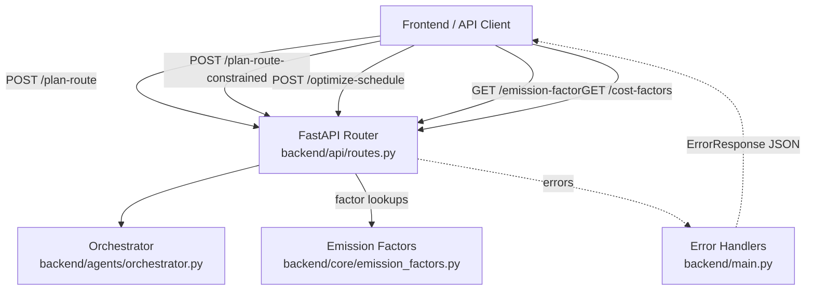
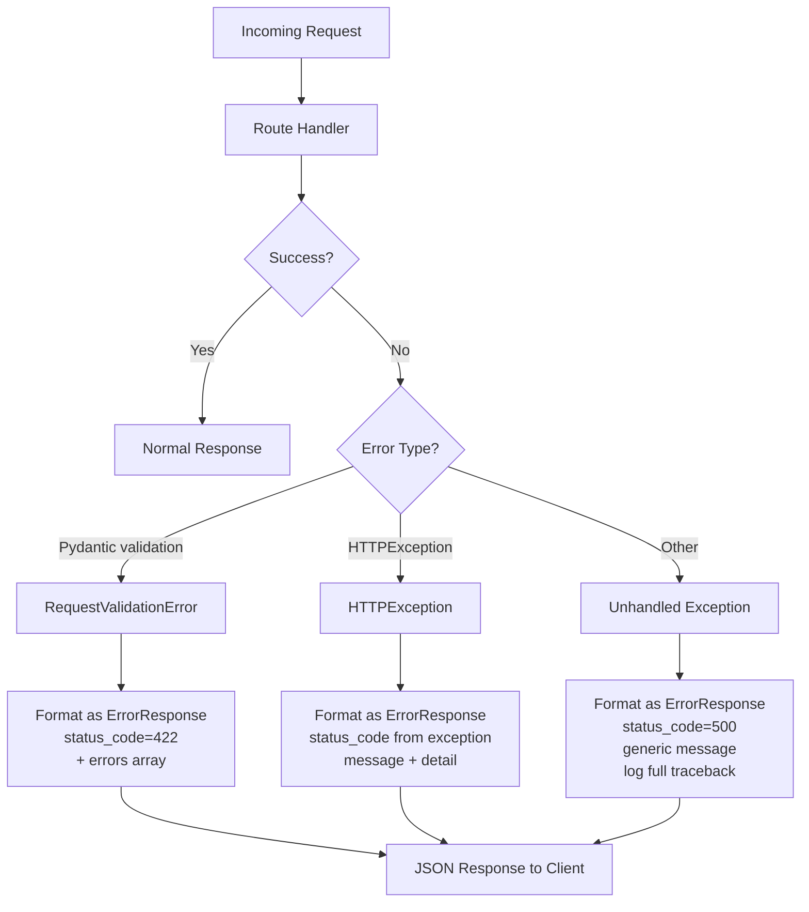

# Design: Client Interface (Phase 1.4)

## Overview

Phase 1.4 ensures all backend API responses from Phases 1.1, 1.2, and 1.3 are properly structured for frontend consumption. This phase does **not** implement the frontend itself — it focuses on backend API contracts, data formatting, and error response consistency so the frontend can build Route Cards, Carbon Charts, explanation panels, and Itinerary Views without additional API calls or client-side data transformation.

### What Exists

| Component | File | Status |
|---|---|---|
| `RouteOption` with all required fields | `backend/models/schemas.py` | ✅ Complete — mode, segments, total_distance_km, total_duration_min, total_emissions_g, total_emissions_kg, total_cost_usd, emission_factor_source, cost_source |
| `RouteSegment` with per-segment fields | `backend/models/schemas.py` | ✅ Complete — mode, distance_km, duration_min, emissions_g, cost_usd, description |
| `RouteComparison` with badge references | `backend/models/schemas.py` | ✅ Complete — greenest, fastest, cheapest, savings_vs_driving_kg |
| `ConstrainedRouteResponse` with recommendation | `backend/models/schemas.py` | ✅ Designed in Phase 1.2 — recommended, justification, ranked_options, unmet_constraints |
| `ScheduleResponse` with itinerary | `backend/models/schemas.py` | ✅ Designed in Phase 1.3 — events, gaps, summary |
| `/api/v1/emission-factors` endpoint | `backend/api/routes.py` | ❌ Missing — designed in Phase 1.1 but not yet implemented |
| `/api/v1/cost-factors` endpoint | `backend/api/routes.py` | ❌ Missing — designed in Phase 1.1 but not yet implemented |
| Standardized `ErrorResponse` model | `backend/models/schemas.py` | ❌ Missing — Phase 1.1 designed a minimal `ErrorResponse` but no global handler |
| Global exception handler | `backend/main.py` | ❌ Missing — errors currently use ad-hoc `HTTPException` raises with inconsistent shapes |
| Frontend TypeScript types | `frontend/src/types/api.ts` | ⚠️ Partial — covers `RouteOption`, `RouteComparison`, `RouteSegment` but missing constrained/schedule/error types |

### What's New in This Design

| Component | File | Description |
|---|---|---|
| `ErrorResponse` model | `backend/models/schemas.py` | Standardized error response with `status_code`, `message`, `detail`, and optional `errors` array |
| `ValidationErrorDetail` model | `backend/models/schemas.py` | Field-level error detail for 422 responses |
| Global exception handler | `backend/main.py` | Catches unhandled exceptions, returns consistent `ErrorResponse` JSON |
| HTTPException override handler | `backend/main.py` | Wraps FastAPI's default HTTPException responses in the `ErrorResponse` format |
| RequestValidationError handler | `backend/main.py` | Wraps Pydantic validation errors into `ErrorResponse` with field-level `errors` array |
| `GET /api/v1/emission-factors` | `backend/api/routes.py` | Returns all emission factors with provenance |
| `GET /api/v1/cost-factors` | `backend/api/routes.py` | Returns all cost factors with provenance |
| Contract tests | `backend/tests/test_contracts.py` | Verify response shapes match frontend expectations across all endpoints |

### Design Decisions

- **Wrap existing HTTPException, don't replace it**: Rather than changing every `raise HTTPException(...)` call across the codebase, we add exception handlers in `main.py` that intercept `HTTPException`, `RequestValidationError`, and unhandled `Exception` and format them into the standardized `ErrorResponse` shape. This is non-invasive and catches all error paths.
- **Field-level errors array only for 422**: The `errors` array with field names and reasons is only populated for validation errors (HTTP 422). Other error codes use `message` and `detail` only. This matches frontend expectations — validation errors need per-field feedback, while other errors need a single message.
- **No changes to existing response models**: The `RouteOption`, `RouteComparison`, `ScheduleResponse`, and `ConstrainedRouteResponse` models already contain all fields the frontend needs. This phase validates that claim via contract tests rather than modifying models.
- **Emission/cost factor endpoints return flat arrays**: The `/emission-factors` and `/cost-factors` endpoints return simple arrays of objects, directly usable as chart data sources without nesting or pagination. The dataset is small (11 modes) and static.

## Architecture

Phase 1.4 adds a cross-cutting error handling layer and two reference data endpoints to the existing architecture:



### Error Handling Flow



## Components and Interfaces

### 1. Error Handlers (`backend/main.py`)

Three exception handlers are registered on the FastAPI app after creation:

```python
from fastapi import FastAPI, Request
from fastapi.exceptions import RequestValidationError
from fastapi.responses import JSONResponse
from starlette.exceptions import HTTPException as StarletteHTTPException

async def http_exception_handler(request: Request, exc: StarletteHTTPException) -> JSONResponse:
    """
    Wrap HTTPException into standardized ErrorResponse format.
    Preserves the original status_code and detail.
    """

async def validation_exception_handler(request: Request, exc: RequestValidationError) -> JSONResponse:
    """
    Wrap Pydantic RequestValidationError into ErrorResponse with field-level errors array.
    Returns HTTP 422 with errors array containing field name and reason for each failure.
    """

async def unhandled_exception_handler(request: Request, exc: Exception) -> JSONResponse:
    """
    Catch-all for unhandled exceptions.
    Logs full traceback server-side, returns generic 500 ErrorResponse.
    Never exposes internal details to the client.
    """
```

**Registration in `create_app()`:**

```python
def create_app() -> FastAPI:
    # ... existing setup ...
    app.add_exception_handler(StarletteHTTPException, http_exception_handler)
    app.add_exception_handler(RequestValidationError, validation_exception_handler)
    app.add_exception_handler(Exception, unhandled_exception_handler)
    return app
```

### 2. Factor Endpoints (`backend/api/routes.py`)

Two new GET endpoints expose the emission and cost factor tables:

```python
@router.get("/emission-factors", response_model=list[EmissionFactorResponse])
async def get_emission_factors() -> list[EmissionFactorResponse]:
    """
    Return all emission factors with provenance.
    Each entry contains mode, g_co2e_per_pkm, source, and notes.
    Directly usable as Carbon_Chart data source.
    """

@router.get("/cost-factors", response_model=list[CostFactorResponse])
async def get_cost_factors() -> list[CostFactorResponse]:
    """
    Return all cost factors with provenance.
    Each entry contains mode, base_fare, per_km_cost, source, and notes.
    """
```

These endpoints read from the existing `EMISSION_FACTORS` and `COST_FACTORS` dictionaries in `backend/core/emission_factors.py` and serialize them into response models.

### 3. Existing Endpoints (unchanged)

All existing endpoints continue to work as-is. The error handlers wrap their error responses transparently:

- `POST /api/v1/plan-route` → `RouteComparison`
- `POST /api/v1/plan-route-constrained` → `ConstrainedRouteResponse`
- `POST /api/v1/optimize-schedule` → `ScheduleResponse`
- `GET /api/v1/health` → `HealthResponse`
- `GET /api/v1/auth/calendar/{provider}` → `AuthUrlResponse`

## Data Models

### New Models

```python
class ValidationErrorDetail(BaseModel):
    """A single field-level validation error."""
    field: str = Field(
        ...,
        description="The field name that failed validation (dot-notation for nested fields).",
    )
    reason: str = Field(
        ...,
        description="Human-readable description of why validation failed.",
    )


class ErrorResponse(BaseModel):
    """Standardized error response used across all endpoints."""
    status_code: int = Field(
        ...,
        description="HTTP status code (mirrors the response status).",
    )
    message: str = Field(
        ...,
        description="Short human-readable error summary.",
    )
    detail: str | None = Field(
        default=None,
        description="Additional context about the error. Null for 500 errors.",
    )
    errors: list[ValidationErrorDetail] | None = Field(
        default=None,
        description="Field-level validation errors. Only present for HTTP 422 responses.",
    )


class EmissionFactorResponse(BaseModel):
    """Emission factor for a single transit mode, formatted for chart rendering."""
    mode: str = Field(..., description="Transit mode identifier.")
    g_co2e_per_pkm: float = Field(..., description="Grams CO2e per passenger-kilometer.")
    source: str = Field(..., description="Data provenance citation.")
    notes: str = Field(default="", description="Additional notes about the factor.")


class CostFactorResponse(BaseModel):
    """Cost factor for a single transit mode, formatted for chart rendering."""
    mode: str = Field(..., description="Transit mode identifier.")
    base_fare: float = Field(..., description="Flat fare in USD (0 for driving/walking/cycling).")
    per_km_cost: float = Field(..., description="USD per kilometer.")
    source: str = Field(..., description="Data provenance citation.")
    notes: str = Field(default="", description="Additional notes about the factor.")
```

### Existing Models (unchanged, validated by contract tests)

The following models already contain all fields required by the frontend. No modifications needed:

**RouteOption** (Phase 1.1):
- `mode`, `segments`, `total_distance_km`, `total_duration_min`, `total_emissions_g`, `total_emissions_kg`, `total_cost_usd`, `emission_factor_source`, `cost_source`

**RouteSegment** (Phase 1.1):
- `mode`, `distance_km`, `duration_min`, `emissions_g`, `cost_usd`, `description`

**RouteComparison** (Phase 1.1):
- `origin`, `destination`, `options`, `greenest`, `fastest`, `cheapest`, `savings_vs_driving_kg`, `reasoning`

**ConstrainedRouteResponse** (Phase 1.2):
- `origin`, `destination`, `options`, `ranked_options`, `recommended`, `greenest`, `fastest`, `cheapest`, `savings_vs_driving_kg`, `tradeoffs`, `justification`, `unmet_constraints`

**ScheduleResponse** (Phase 1.3):
- `itinerary` containing `date`, `events`, `excluded_events`, `gaps`, `summary`, `mode_sequence`
- Each `CalendarEvent` contains `summary` (title), `location`, `start`, `end`
- Each `GapRouteResult` contains `gap`, `route_comparison`, `recommended_mode`, `recommended_emissions_g`, `recommended_duration_min`, `recommended_cost_usd`, `infeasible_reason`
- `ItinerarySummary` contains `total_emissions_g`, `total_cost_usd`, `total_transit_min`, `all_driving_baseline_g`, `savings_vs_driving_g`

### Error Response Examples

**HTTP 422 — Validation Error:**

```json
{
  "status_code": 422,
  "message": "Validation error",
  "detail": "One or more fields failed validation.",
  "errors": [
    {"field": "origin", "reason": "must not be empty or whitespace-only"},
    {"field": "modes.0", "reason": "value is not a valid enumeration member"}
  ]
}
```

**HTTP 401 — Authentication Error:**

```json
{
  "status_code": 401,
  "message": "Authentication required",
  "detail": "Invalid or expired session. Please re-authenticate via /auth/calendar/google"
}
```

**HTTP 500 — Internal Server Error:**

```json
{
  "status_code": 500,
  "message": "Internal server error",
  "detail": null
}
```

**HTTP 503 — Service Unavailable:**

```json
{
  "status_code": 503,
  "message": "Service unavailable",
  "detail": "Google OAuth not configured. Set GOOGLE_CLIENT_ID and GOOGLE_CLIENT_SECRET in .env"
}
```

### Exception Handler Implementation

```python
async def http_exception_handler(request: Request, exc: StarletteHTTPException) -> JSONResponse:
    return JSONResponse(
        status_code=exc.status_code,
        content=ErrorResponse(
            status_code=exc.status_code,
            message=HTTP_STATUS_MESSAGES.get(exc.status_code, "Error"),
            detail=str(exc.detail) if exc.detail else None,
        ).model_dump(),
    )


async def validation_exception_handler(request: Request, exc: RequestValidationError) -> JSONResponse:
    errors = []
    for err in exc.errors():
        field = ".".join(str(loc) for loc in err["loc"] if loc != "body")
        errors.append(ValidationErrorDetail(field=field, reason=err["msg"]))
    return JSONResponse(
        status_code=422,
        content=ErrorResponse(
            status_code=422,
            message="Validation error",
            detail="One or more fields failed validation.",
            errors=errors,
        ).model_dump(),
    )


async def unhandled_exception_handler(request: Request, exc: Exception) -> JSONResponse:
    logger.exception("Unhandled exception on %s %s", request.method, request.url.path)
    return JSONResponse(
        status_code=500,
        content=ErrorResponse(
            status_code=500,
            message="Internal server error",
            detail=None,
        ).model_dump(),
    )


# Status code to message mapping for common codes
HTTP_STATUS_MESSAGES: dict[int, str] = {
    400: "Bad request",
    401: "Authentication required",
    403: "Forbidden",
    404: "Not found",
    409: "Conflict",
    422: "Validation error",
    429: "Too many requests",
    500: "Internal server error",
    502: "Bad gateway",
    503: "Service unavailable",
}
```

## Correctness Properties

*A property is a characteristic or behavior that should hold true across all valid executions of a system — essentially, a formal statement about what the system should do. Properties serve as the bridge between human-readable specifications and machine-verifiable correctness guarantees.*

### Property 1: RouteOption structural completeness

*For any* `RouteOption` produced by the emissions agent pipeline from *any* valid `RawRouteResult`, the option SHALL contain non-null values for `mode`, `total_distance_km`, `total_duration_min`, `total_emissions_g`, `total_emissions_kg`, `total_cost_usd`, `emission_factor_source`, and `cost_source`. Furthermore, each entry in the `segments` array SHALL contain non-null values for `mode`, `distance_km`, `duration_min`, `emissions_g`, `cost_usd`, and `description`.

**Validates: Requirements 1.1, 1.2**

### Property 2: Emission factors endpoint completeness

*For any* member of the `TransitMode` enum, the `/api/v1/emission-factors` response SHALL contain exactly one entry with that mode value, a non-negative `g_co2e_per_pkm`, and a non-empty `source` string. The total number of entries SHALL equal the number of `TransitMode` enum members.

**Validates: Requirements 2.1**

### Property 3: Cost factors endpoint completeness

*For any* member of the `TransitMode` enum, the `/api/v1/cost-factors` response SHALL contain exactly one entry with that mode value, non-negative `base_fare` and `per_km_cost`, and a non-empty `source` string. The total number of entries SHALL equal the number of `TransitMode` enum members.

**Validates: Requirements 2.2**

### Property 4: Schedule response event field completeness

*For any* `CalendarEvent` in a `ScheduleResponse.itinerary.events` list, the event SHALL contain non-empty `summary`, `start`, and `end` fields, and a `location` field (non-empty, since events without locations are excluded during parsing).

**Validates: Requirements 4.1**

### Property 5: Error response structural consistency

*For any* HTTP error response (status code ≥ 400) produced by *any* endpoint, the response body SHALL be valid JSON containing at minimum `status_code` (integer matching the HTTP status), `message` (non-empty string), and `detail` (string or null). The `status_code` field in the body SHALL equal the HTTP response status code.

**Validates: Requirements 5.1, 5.4**

### Property 6: Validation error field-level detail

*For any* HTTP 422 response produced by *any* endpoint due to request validation failure, the response body SHALL contain an `errors` array with at least one entry. Each entry SHALL contain a non-empty `field` string and a non-empty `reason` string.

**Validates: Requirements 5.2**

## Error Handling

### Error Response Standardization

All error responses across all endpoints are now handled by three exception handlers registered in `main.py`. This replaces the ad-hoc error formatting that existed previously.

| Error Type | Handler | Status Code | Response Shape |
|---|---|---|---|
| `RequestValidationError` (Pydantic) | `validation_exception_handler` | 422 | `ErrorResponse` with `errors` array containing field-level details |
| `HTTPException` (FastAPI) | `http_exception_handler` | Varies (400, 401, 403, 404, 503, etc.) | `ErrorResponse` with `message` and `detail` |
| Unhandled `Exception` | `unhandled_exception_handler` | 500 | `ErrorResponse` with generic message, `detail=null`, full traceback logged server-side |

### Specific Error Scenarios

| Scenario | Status | Message | Detail |
|---|---|---|---|
| Empty origin/destination | 422 | "Validation error" | Field-level error: "must not be empty or whitespace-only" |
| Invalid TransitMode value | 422 | "Validation error" | Field-level error with valid enum values listed |
| Invalid date format | 422 | "Validation error" | "Invalid date format. Use YYYY-MM-DD" |
| Expired/invalid session | 401 | "Authentication required" | "Invalid or expired session. Please re-authenticate via /auth/calendar/{provider}" |
| OAuth not configured | 503 | "Service unavailable" | "OAuth not configured for {provider}. Set {PROVIDER}_CLIENT_ID and {PROVIDER}_CLIENT_SECRET in .env" |
| Calendar API unreachable | 502 | "Bad gateway" | "Calendar service unreachable. Please try again later." |
| Unhandled internal error | 500 | "Internal server error" | `null` (no internal details exposed) |

### Security Considerations

- HTTP 500 responses never include stack traces, file paths, or internal error messages
- The `unhandled_exception_handler` logs the full traceback via Python's `logging` module for server-side debugging
- Error `detail` fields for non-500 errors contain only user-facing context (e.g., "Use YYYY-MM-DD" format guidance)

## Testing Strategy

### Property-Based Testing

This feature is suitable for property-based testing. The structural invariants on response models and the error response formatting are pure functions with clear input/output behavior that should hold across all valid inputs.

**Library**: [Hypothesis](https://hypothesis.readthedocs.io/) for Python

**Configuration**: Minimum 100 iterations per property test.

**Tag format**: `Feature: client-interface, Property {number}: {property_text}`

Properties 1–6 each map to one property-based test. Generators will produce:
- Random `RawRouteResult` objects with valid segment structures and positive distances/durations for Property 1
- Random `TransitMode` values sampled from the enum for Properties 2 and 3
- Random `CalendarEvent` objects with valid ISO 8601 datetimes and non-empty locations for Property 4
- Random invalid request payloads (empty strings, invalid enum values, missing fields, wrong types) for Properties 5 and 6

### Unit Tests (Example-Based)

| Test | Requirement | Description |
|---|---|---|
| RouteComparison includes badge references | Req 1.3 | POST /plan-route, verify `greenest`, `fastest`, `cheapest` fields present |
| RouteComparison includes savings_vs_driving_kg | Req 1.4 | POST /plan-route with driving mode, verify `savings_vs_driving_kg` is non-null |
| Route_Option numeric fields are chart-ready | Req 2.3 | Verify `total_emissions_g`, `total_cost_usd`, `total_duration_min` are numeric (not null, not string) |
| Emission factors returns all 11 modes | Req 2.1 | GET /emission-factors, verify 11 entries with correct fields |
| Cost factors returns all 11 modes | Req 2.2 | GET /cost-factors, verify 11 entries with correct fields |
| Constrained response includes recommended | Req 3.1 | POST /plan-route-constrained, verify `recommended` field present |
| Constrained response includes justification | Req 3.2 | POST /plan-route-constrained, verify `justification` is non-empty string |
| Constrained response includes ranked_options | Req 3.3 | POST /plan-route-constrained, verify `ranked_options` is a list |
| Fallback explanation on all-filtered | Req 3.4 | POST /plan-route-constrained with impossible constraints, verify `unmet_constraints` populated |
| Schedule response includes ordered events | Req 4.1 | POST /optimize-schedule, verify `events` array with required fields |
| Schedule response includes gap routes | Req 4.2 | POST /optimize-schedule, verify `gaps` array with route recommendations |
| Schedule response includes emissions summary | Req 4.3 | POST /optimize-schedule, verify `summary` with `total_emissions_g` and per-gap emissions |
| Infeasible gap includes flag and reason | Req 4.4 | POST /optimize-schedule with tight events, verify `infeasible_reason` set |
| HTTP 500 returns generic message | Req 5.3 | Trigger unhandled exception, verify response has no stack trace |
| Error format consistent across endpoints | Req 5.4 | Trigger errors on multiple endpoints, verify all use `ErrorResponse` shape |

### Contract Tests

Contract tests verify that actual API responses match the shapes the frontend expects. These are integration-level tests that call real endpoints (with mock routing) and validate the full response structure.

| Test | Description |
|---|---|
| RouteComparison contract | POST /plan-route → verify response matches `RouteComparison` TypeScript interface |
| ConstrainedRouteResponse contract | POST /plan-route-constrained → verify response matches expected shape |
| ScheduleResponse contract | POST /optimize-schedule → verify response matches expected shape |
| EmissionFactors contract | GET /emission-factors → verify array of `{mode, g_co2e_per_pkm, source}` |
| CostFactors contract | GET /cost-factors → verify array of `{mode, base_fare, per_km_cost, source}` |
| ErrorResponse 422 contract | Send invalid request → verify `{status_code, message, detail, errors}` shape |
| ErrorResponse 500 contract | Trigger internal error → verify `{status_code, message, detail}` shape with null detail |

### Test Organization

```
backend/
  tests/
    test_contracts.py           # Contract tests for all endpoint response shapes
    test_error_handlers.py      # Properties 5-6, error response format tests
    test_factor_endpoints.py    # Properties 2-3, emission/cost factor endpoint tests
    test_route_contracts.py     # Property 1, RouteOption structural completeness
    test_schedule_contracts.py  # Property 4, ScheduleResponse event field completeness
```
