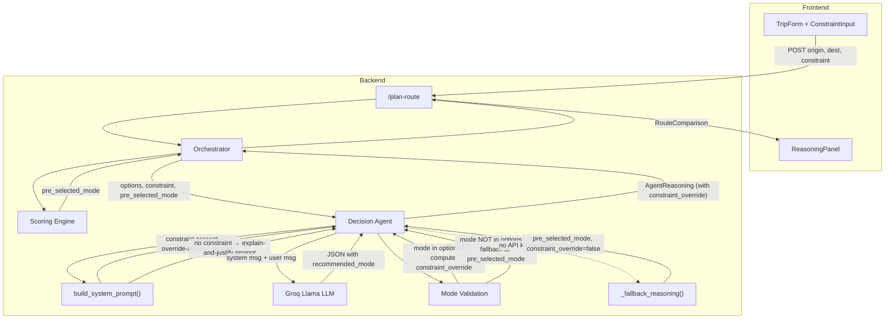

# Design Document: Constraint Override Recommendation

## Overview

This feature grants the Decision Agent LLM authority to override the scoring engine's pre-selected recommendation when a user constraint is present. Today, the system prompt tells the LLM to "explain and justify" the pre-selected mode, which means the LLM rubber-stamps the scoring engine's pick even when the constraint directly conflicts with it (e.g., user says "I want to save money" but the scoring engine picked the fastest, most expensive mode).

The change is scoped to two areas:

1. **System prompt branching** — When a constraint is present, the system prompt instructs the LLM that it *may* select a different mode from the available options. When no constraint is present, the prompt continues to instruct the LLM to explain and justify the pre-selected mode (current behavior).
2. **Response validation and override indication** — The `AgentReasoning` model gains a `constraint_override` boolean field. After the LLM responds, the Decision Agent validates that the returned mode exists in the available options and computes whether an override occurred by comparing the LLM's pick to the pre-selected mode.

### Key Design Decisions

1. **Prompt branching, not prompt patching** — Rather than appending override instructions to every prompt, we use two distinct prompt templates: one for the constrained case (override allowed) and one for the unconstrained case (explain and justify). This makes the LLM's behavioral contract explicit and testable as a pure function.
2. **Override detection is post-hoc, not LLM-reported** — The `constraint_override` flag is computed deterministically by comparing `reasoning.recommended_mode != pre_selected_mode` when a constraint is present. We do not ask the LLM to self-report whether it overrode, because that would be unreliable.
3. **Invalid mode fallback** — If the LLM returns a mode not present in the available options, we fall back to the pre-selected mode and set `constraint_override = false`. This ensures the system never surfaces an impossible route.
4. **Fallback reasoning is unchanged** — The deterministic `_fallback_reasoning` path remains constraint-unaware. It always uses the pre-selected mode and sets `constraint_override = false`.
5. **`build_system_prompt` is extended, not replaced** — The existing `build_system_prompt` function from the constraint-system-prompt feature is updated so that when a constraint is present, the appended block includes override authority instructions (not just the constraint text). The function signature is unchanged.

## Architecture



### Data Flow

1. **TripForm** sends `{ origin, destination, constraint, priority }` to `POST /plan-route`.
2. **Orchestrator** runs the scoring engine, which produces a `pre_selected_mode`.
3. **Orchestrator** passes `options`, `constraint`, and `pre_selected_mode` to `decide()`.
4. **Decision Agent** calls `build_system_prompt(SYSTEM_PROMPT, constraint)`:
   - If constraint is non-empty: returns a prompt that includes the constraint AND override authority instructions telling the LLM it may pick a different mode.
   - If constraint is `None` or whitespace-only: returns the base prompt instructing the LLM to explain and justify the pre-selected mode.
5. **Decision Agent** sends `[system_msg, user_msg]` to the LLM.
6. **Decision Agent** parses the LLM response and validates the returned `recommended_mode`:
   - If the mode is in the available options: accept it.
   - If the mode is NOT in the available options: fall back to `pre_selected_mode`.
7. **Decision Agent** computes `constraint_override = (constraint is present) AND (recommended_mode != pre_selected_mode)`.
8. If the LLM call fails or no API key is present, `_fallback_reasoning` is used with `constraint_override = false`.

## Components and Interfaces

### 1. Updated `SYSTEM_PROMPT` Constant

The base `SYSTEM_PROMPT` is updated to be the no-constraint version. It continues to instruct the LLM to explain and justify the pre-selected mode:

```python
SYSTEM_PROMPT = """\
You are a carbon-aware transit advisor. You receive structured route data \
comparing transit modes between two locations. Each option includes distance, \
duration, CO2 emissions, and cost.

A deterministic scoring engine has already selected the recommended route. \
Your job is to explain and justify that selection:
1. Explain why the pre-selected route is a good choice given the data.
2. Analyze the trade-offs between speed, cost, and carbon impact.
3. Explain your reasoning in plain, concise language — no jargon.

Always ground your reasoning in the actual numbers provided. \
Never fabricate data or reference modes not in the options.

Respond with JSON only, no markdown fences:
{
  "recommended_mode": "<the pre-selected mode value>",
  "summary": "<1-2 sentence recommendation>",
  "justification": "<detailed reasoning comparing the trade-offs>",
  "constraint_analysis": null
}\
"""
```

This is unchanged from the current prompt.

### 2. Updated `build_system_prompt` Function

The existing `build_system_prompt` function is updated to include override authority instructions when a constraint is present:

```python
CONSTRAINT_OVERRIDE_BLOCK = (
    "--- USER CONSTRAINT ---\n"
    "The user has specified the following constraint. "
    "You MUST prioritize this constraint when selecting a mode and "
    "generating the constraint_analysis field.\n"
    "You MAY select a different mode from the available options if the "
    "constraint warrants it — you are NOT required to recommend the "
    "pre-selected mode. Choose the mode that best satisfies the constraint "
    "from the options provided.\n"
    "If the pre-selected mode already satisfies the constraint, keep it.\n"
    "You MUST only select a mode that appears in the provided route options.\n"
)


def build_system_prompt(base_prompt: str, constraint: str | None) -> str:
    """
    Assemble the system prompt for the Decision Agent.

    If a non-empty constraint is provided, appends override authority
    instructions and the constraint text. Otherwise returns the base
    prompt unchanged.
    """
    if not constraint or not constraint.strip():
        return base_prompt

    trimmed = constraint.strip()
    return (
        f"{base_prompt}\n\n"
        f"{CONSTRAINT_OVERRIDE_BLOCK}"
        f"{trimmed}"
    )
```

**Design rationale:**
- The `--- USER CONSTRAINT ---` header provides a clear delimiter.
- The "You MAY select a different mode" instruction explicitly grants override authority.
- The "You MUST only select a mode that appears in the provided route options" instruction constrains the LLM to valid modes.
- The "If the pre-selected mode already satisfies the constraint, keep it" instruction prevents unnecessary overrides.
- When no constraint is present, the base prompt (which says "explain and justify") is returned unchanged, preserving current behavior.

### 3. Updated `decide()` Function

The `decide()` function gains mode validation and override detection logic:

```python
async def decide(
    origin: str,
    destination: str,
    options: list[RouteOption],
    constraint: str | None = None,
    recommended_mode: TransitMode | None = None,
    api_key: str = "",
) -> AgentReasoning:
    if not api_key or not options:
        return _fallback_reasoning(options, recommended_mode=recommended_mode)

    available_modes = {opt.mode for opt in options}

    try:
        client = AsyncOpenAI(...)
        system_prompt = build_system_prompt(SYSTEM_PROMPT, constraint)

        response = await client.chat.completions.create(...)
        raw = response.choices[0].message.content
        data = json.loads(raw)

        llm_mode = TransitMode(data["recommended_mode"])

        # Validate: LLM must pick a mode that exists in the options
        if llm_mode not in available_modes:
            return _fallback_reasoning(options, recommended_mode=recommended_mode)

        # Compute override flag
        has_constraint = bool(constraint and constraint.strip())
        is_override = has_constraint and (llm_mode != recommended_mode)

        return AgentReasoning(
            recommended_mode=llm_mode,
            summary=data["summary"],
            justification=data["justification"],
            constraint_analysis=data.get("constraint_analysis"),
            constraint_override=is_override,
        )

    except Exception as e:
        print(f"[WARN] Decision agent failed: {e}. Using fallback.")
        return _fallback_reasoning(options, recommended_mode=recommended_mode)
```

**Key changes:**
- `available_modes` set is computed from the options list.
- After parsing the LLM response, the returned mode is validated against `available_modes`.
- If the mode is invalid, we fall back to `_fallback_reasoning` (which uses `recommended_mode` and sets `constraint_override=false`).
- `constraint_override` is computed deterministically: `True` only when a constraint is present AND the LLM picked a different mode than the pre-selected one.

### 4. Updated `_fallback_reasoning` Function

The fallback function is updated to include `constraint_override=False` in its return value:

```python
def _fallback_reasoning(
    options: list[RouteOption],
    recommended_mode: TransitMode | None = None,
) -> AgentReasoning:
    # ... existing logic unchanged ...
    return AgentReasoning(
        recommended_mode=best.mode,
        summary=...,
        justification=...,
        constraint_override=False,  # <-- NEW: fallback never overrides
    )
```

The signature is unchanged. The only addition is the `constraint_override=False` field in the returned `AgentReasoning`.

### 5. Orchestrator — Minimal Change

The orchestrator already passes `constraint` and `recommended_mode` to `decide()`. The only change is that it now uses the `recommended_mode` from the `AgentReasoning` response (which may differ from the scoring engine's pick) as the final recommendation. This is already the case in the current code — the orchestrator returns `reasoning.recommended_mode` as part of the `RouteComparison`, and the frontend reads it from there.

No code changes needed in the orchestrator.

### 6. Frontend — Display Override Indicator

The `ReasoningPanel` component is updated to show an override badge when `constraint_override` is `true`:

```tsx
{reasoning.constraint_override && (
  <div className="...override-badge...">
    <span className="material-symbols-outlined">swap_horiz</span>
    Recommendation adjusted based on your constraint
  </div>
)}
```

This is a display-only change. The frontend reads the new `constraint_override` field from the `AgentReasoning` response.

## Data Models

### Schema Changes

**`AgentReasoning`** in `backend/models/schemas.py` — one new field:

```python
class AgentReasoning(BaseModel):
    recommended_mode: TransitMode
    summary: str = Field(..., description="1-2 sentence recommendation")
    justification: str = Field(..., description="Detailed reasoning comparing trade-offs")
    constraint_analysis: str | None = Field(
        default=None,
        description="How the recommendation satisfies the user's constraint",
    )
    constraint_override: bool = Field(
        default=False,
        description="True when the LLM selected a different mode than the scoring engine's pick due to a constraint.",
    )
```

**`AgentReasoning`** in `frontend/src/types/api.ts` — mirror:

```typescript
export interface AgentReasoning {
  recommended_mode: TransitMode;
  summary: string;
  justification: string;
  constraint_analysis: string | null;
  constraint_override: boolean;
}
```

| Model | Field | Change |
|-------|-------|--------|
| `AgentReasoning` (Pydantic) | `constraint_override: bool = False` | **New field** — defaults to `False` for backward compatibility |
| `AgentReasoning` (TypeScript) | `constraint_override: boolean` | **New field** — mirrors Pydantic |
| `RouteRequest` | — | No change |
| `RouteComparison` | — | No change |

### System Prompt Structure

**With constraint (override allowed):**
```
<base SYSTEM_PROMPT — explain and justify>

--- USER CONSTRAINT ---
The user has specified the following constraint. You MUST prioritize this constraint when selecting a mode and generating the constraint_analysis field.
You MAY select a different mode from the available options if the constraint warrants it — you are NOT required to recommend the pre-selected mode. Choose the mode that best satisfies the constraint from the options provided.
If the pre-selected mode already satisfies the constraint, keep it.
You MUST only select a mode that appears in the provided route options.
<trimmed constraint text>
```

**Without constraint:**
```
<base SYSTEM_PROMPT — explain and justify>
```
(Unchanged from current behavior.)


## Correctness Properties

*A property is a characteristic or behavior that should hold true across all valid executions of a system — essentially, a formal statement about what the system should do. Properties serve as the bridge between human-readable specifications and machine-verifiable correctness guarantees.*

### Property 1: Constrained prompt structural completeness

*For any* non-empty (after trimming) constraint string and any base prompt string, the assembled system prompt SHALL start with the exact base prompt text, contain the `--- USER CONSTRAINT ---` delimiter, contain override authority language ("MAY select a different mode"), contain constraint precedence language ("MUST prioritize this constraint"), contain mode restriction language ("MUST only select a mode that appears in the provided route options"), and contain the trimmed constraint text.

**Validates: Requirements 1.1, 1.2, 1.4**

### Property 2: No-constraint prompt preservation

*For any* base prompt string and any constraint that is `None` or composed entirely of whitespace characters, calling `build_system_prompt` SHALL return a string identical to the base prompt with no additions.

**Validates: Requirements 1.3**

### Property 3: Override detection correctness

*For any* pair of transit modes `(llm_mode, pre_selected_mode)` and any optional constraint string, the `constraint_override` flag SHALL be `True` if and only if all three conditions hold: (a) a non-empty constraint is present, (b) `llm_mode` is a valid mode in the available options, and (c) `llm_mode != pre_selected_mode`. In all other cases, `constraint_override` SHALL be `False`.

**Validates: Requirements 2.3, 4.2, 4.3**

### Property 4: Fallback reasoning always sets constraint_override to false

*For any* list of route options and any optional `recommended_mode`, calling `_fallback_reasoning` SHALL return an `AgentReasoning` with `constraint_override == False`.

**Validates: Requirements 4.4, 5.3**

### Property 5: Invalid mode rejection

*For any* set of available route options and any `recommended_mode` returned by the LLM that is NOT present in the available options' modes, the Decision Agent SHALL fall back to the pre-selected mode and set `constraint_override` to `False`.

**Validates: Requirements 2.4, 7.1**

## Error Handling

| Scenario | Handling |
|----------|----------|
| Constraint is `None` | `build_system_prompt` returns the base prompt unchanged (no override authority). `constraint_override` is `False`. |
| Constraint is empty string `""` | Treated as absent — same as `None`. |
| Constraint is whitespace-only (e.g. `"   "`) | Trimmed to empty, treated as absent — base prompt returned unchanged. |
| LLM returns a mode not in available options | `decide()` falls back to `_fallback_reasoning` using the pre-selected mode. `constraint_override` is `False`. |
| LLM returns unparseable JSON | Existing `except` block catches `json.loads` failure. Falls back to `_fallback_reasoning`. `constraint_override` is `False`. |
| LLM returns an unknown mode string | `TransitMode(data["recommended_mode"])` raises `ValueError`. Caught by `except`. Falls back to `_fallback_reasoning`. `constraint_override` is `False`. |
| LLM API key missing | `decide()` returns `_fallback_reasoning` before any LLM call. `constraint_override` is `False`. |
| LLM call fails (network, rate limit, etc.) | Existing `except` block catches the error. Falls back to `_fallback_reasoning`. `constraint_override` is `False`. |
| Constraint contains special characters, newlines, unicode | Included as-is after trimming. The LLM handles interpretation. Override detection still works because it compares modes, not constraint text. |
| LLM returns the pre-selected mode with a constraint present | `constraint_override` is `False` (no override occurred). `constraint_analysis` may still contain analysis of why the pre-selected mode satisfies the constraint. |
| Options list is empty | `decide()` returns `_fallback_reasoning([])` which returns a default walking response with `constraint_override=False`. |

## Testing Strategy

### Property-Based Tests (Hypothesis)

The project uses **Hypothesis** for property-based testing. Each correctness property maps to a Hypothesis test in `backend/tests/test_decision_agent.py`.

**Configuration:**
- Minimum 100 examples per property test (`@settings(max_examples=100)`)
- Each test tagged with a comment: `# Feature: constraint-override-recommendation, Property N: <title>`

**Hypothesis strategies:**

```python
# Non-empty constraint strings (after trimming)
constraint_strategy = st.text(min_size=1).filter(lambda s: s.strip())

# Whitespace-only strings
whitespace_strategy = st.text(
    alphabet=st.sampled_from([' ', '\t', '\n', '\r']),
    min_size=0, max_size=50,
)

# Base prompt strings (non-empty)
base_prompt_strategy = st.text(min_size=1, max_size=500)

# Random transit modes
mode_strategy = st.sampled_from(list(TransitMode))

# Random subsets of transit modes (for available_modes sets)
mode_set_strategy = st.frozensets(mode_strategy, min_size=1)
```

**Property test mapping:**

| Property | Test | What it generates | What it asserts |
|----------|------|-------------------|-----------------|
| 1: Constrained prompt structural completeness | `test_constrained_prompt_contains_override_authority` | Random non-empty constraints + base prompts | Output starts with base, contains delimiter, override authority, precedence, mode restriction, and constraint text |
| 2: No-constraint prompt preservation | `test_no_constraint_returns_base_unchanged` | Random base prompts + whitespace/None constraints | Output == base prompt exactly |
| 3: Override detection correctness | `test_override_flag_correctness` | Random pairs of modes + optional constraints | `constraint_override == (has_constraint AND llm_mode != pre_selected_mode)` |
| 4: Fallback constraint_override always false | `test_fallback_constraint_override_always_false` | Random option lists + recommended modes | `constraint_override == False` |
| 5: Invalid mode rejection | `test_invalid_mode_triggers_fallback` | Random option sets + modes NOT in the set | Falls back to pre-selected mode with `constraint_override == False` |

### Unit Tests (pytest)

Example-based tests for specific scenarios:

**Schema:**
- `AgentReasoning` has `constraint_override` field with default `False`
- Existing `AgentReasoning` instances without `constraint_override` still parse (backward compat via default)

**Prompt construction:**
- `build_system_prompt` with `None` returns base prompt (no override language)
- `build_system_prompt` with `"I want to save money"` contains override authority and constraint text
- `build_system_prompt` with `""` returns base prompt unchanged

**Override scenarios (mocked LLM):**
- LLM returns a different mode with constraint → `constraint_override=True`, mode accepted
- LLM returns the same mode with constraint → `constraint_override=False`
- LLM returns a mode not in options → fallback used, `constraint_override=False`
- LLM returns unparseable JSON → fallback used, `constraint_override=False`

**Fallback paths:**
- `decide()` with no API key and a constraint → fallback, `constraint_override=False`
- `decide()` with empty options and a constraint → fallback, `constraint_override=False`
- `_fallback_reasoning` always returns `constraint_override=False`

**No-constraint behavior:**
- `decide()` with no constraint → prompt has no override language, `constraint_override=False`

### Integration Tests

- Orchestrator passes constraint and pre-selected mode through to `decide()` unchanged (Req 6.1, 6.2)
- Orchestrator uses the `recommended_mode` from `AgentReasoning` (which may differ from scoring engine's pick) in the final `RouteComparison` (Req 6.3)
- Mock `decide()` to return an overridden mode → verify `RouteComparison.reasoning.recommended_mode` reflects the override

### Frontend Tests

- `AgentReasoning` TypeScript type includes `constraint_override: boolean`
- `ReasoningPanel` renders override badge when `constraint_override` is `true`
- `ReasoningPanel` does not render override badge when `constraint_override` is `false`
