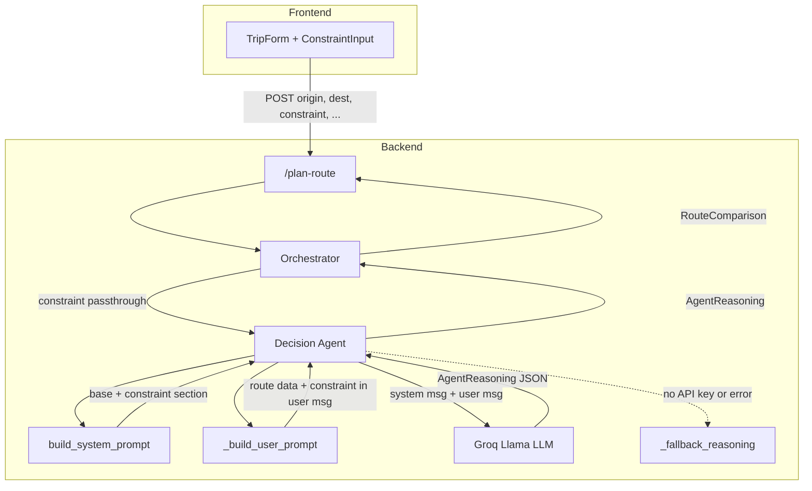

# Design Document: Constraint System Prompt Injection

## Overview

This feature makes the user's constraint a first-class instruction in the Decision Agent's LLM system prompt. Currently, `SYSTEM_PROMPT` in `backend/agents/decision_agent.py` is a static string, and the constraint only appears in the user message built by `_build_user_prompt()`. By dynamically constructing the system prompt to include the constraint as an authoritative instruction, the LLM treats it with higher priority when generating its recommendation, summary, justification, and `constraint_analysis`.

### Key Design Decisions

1. **Pure function for prompt assembly** — A new `build_system_prompt(base_prompt, constraint)` function handles all prompt construction logic. It is a pure function (no I/O, no side effects) so it can be tested without making LLM calls.
2. **Constraint in both system and user messages** — The constraint remains in the user message (via `_build_user_prompt`) for data context, and is additionally injected into the system prompt as an authoritative instruction. This dual placement follows LLM best practices where system-level instructions set behavioral priorities and user-level data provides context.
3. **Whitespace-only treated as absent** — A constraint that is empty or contains only whitespace is treated as `None`, so the base prompt is used unmodified.
4. **No changes to fallback reasoning** — The deterministic `_fallback_reasoning` path is untouched. It does not interpret the system prompt and continues to work as before.
5. **No changes to the API contract** — `RouteRequest.constraint` already exists. The orchestrator already passes it to `decide()`. This feature only changes how `decide()` uses the constraint internally.

## Architecture



### Data Flow

1. **TripForm** sends `{ origin, destination, constraint, ... }` to `POST /plan-route`.
2. **Orchestrator** passes the constraint string unchanged to `decide()`.
3. **Decision Agent** calls `build_system_prompt(SYSTEM_PROMPT, constraint)`:
   - If constraint is non-empty (after trimming), returns the base prompt with an appended constraint section.
   - If constraint is `None` or whitespace-only, returns the base prompt unmodified.
4. **Decision Agent** calls `_build_user_prompt(...)` which continues to include the constraint in the user message (unchanged behavior).
5. **Decision Agent** sends `[system_msg, user_msg]` to the LLM.
6. If the LLM call fails or no API key is present, `_fallback_reasoning` is used (unchanged).

## Components and Interfaces

### 1. `build_system_prompt` — New Pure Function (`backend/agents/decision_agent.py`)

```python
def build_system_prompt(base_prompt: str, constraint: str | None) -> str:
    """
    Assemble the system prompt for the Decision Agent.

    If a non-empty constraint is provided, appends it as a clearly labeled
    authoritative instruction section. Otherwise returns the base prompt
    unchanged.
    """
    if not constraint or not constraint.strip():
        return base_prompt

    trimmed = constraint.strip()
    return (
        f"{base_prompt}\n\n"
        f"--- USER CONSTRAINT ---\n"
        f"The user has specified the following constraint. "
        f"You MUST prioritize this constraint when analyzing trade-offs "
        f"and generating the constraint_analysis field:\n"
        f"{trimmed}"
    )
```

**Design rationale:**
- The `--- USER CONSTRAINT ---` header provides a clear visual delimiter so the LLM can distinguish base instructions from the constraint.
- The directive ("You MUST prioritize this constraint...") tells the model to weight the constraint heavily in its reasoning, particularly in the `constraint_analysis` output field.
- Whitespace trimming prevents accidental injection of empty constraint sections.

### 2. Updated `decide()` Function (`backend/agents/decision_agent.py`)

The only change to `decide()` is replacing the static `SYSTEM_PROMPT` reference with a call to `build_system_prompt`:

```python
async def decide(
    origin: str,
    destination: str,
    options: list[RouteOption],
    constraint: str | None = None,
    recommended_mode: TransitMode | None = None,
    api_key: str = "",
) -> AgentReasoning:
    if not api_key or not options:
        return _fallback_reasoning(options, recommended_mode=recommended_mode)

    try:
        client = AsyncOpenAI(
            api_key=api_key,
            base_url="https://api.groq.com/openai/v1",
        )

        system_prompt = build_system_prompt(SYSTEM_PROMPT, constraint)  # <-- NEW

        response = await client.chat.completions.create(
            model="llama-3.1-8b-instant",
            max_tokens=512,
            temperature=0.3,
            messages=[
                {"role": "system", "content": system_prompt},  # <-- was SYSTEM_PROMPT
                {
                    "role": "user",
                    "content": _build_user_prompt(
                        origin, destination, options, constraint,
                        recommended_mode=recommended_mode,
                    ),
                },
            ],
        )
        # ... rest unchanged
```

### 3. `SYSTEM_PROMPT` Constant — Unchanged

The existing `SYSTEM_PROMPT` string remains as-is. It serves as the `base_prompt` argument to `build_system_prompt`. No modifications to its content.

### 4. `_build_user_prompt` — Unchanged

The existing function continues to append `\n\nUser constraint: {constraint}` to the user message when a constraint is provided. This is intentional — the constraint appears in both the system prompt (as an instruction) and the user message (as contextual data alongside the route options).

### 5. `_fallback_reasoning` — Unchanged

The deterministic fallback path does not read the system prompt and is not affected by this feature.

### 6. Orchestrator — No Changes Required

The orchestrator already passes `constraint` to `decide()`:

```python
reasoning = await decide(
    origin=origin,
    destination=destination,
    options=options,
    constraint=constraint,          # already passed through
    recommended_mode=recommended_mode,
    api_key=groq_api_key,
)
```

No changes needed. The constraint flows from `RouteRequest.constraint` → `plan_route(constraint=...)` → `decide(constraint=...)` without modification.

## Data Models

No schema changes are required for this feature. The existing models already support the constraint:

| Model | Field | Status |
|-------|-------|--------|
| `RouteRequest` | `constraint: str \| None` | Exists — no change |
| `AgentReasoning` | `constraint_analysis: str \| None` | Exists — no change |
| `RouteComparison` | `reasoning: AgentReasoning \| None` | Exists — no change |

### System Prompt Structure

When a constraint is present, the assembled system prompt has this structure:

```
<base SYSTEM_PROMPT content>

--- USER CONSTRAINT ---
The user has specified the following constraint. You MUST prioritize this constraint when analyzing trade-offs and generating the constraint_analysis field:
<trimmed constraint text>
```

When no constraint is present (or whitespace-only), the system prompt is exactly the base `SYSTEM_PROMPT` with no additions.


## Correctness Properties

*A property is a characteristic or behavior that should hold true across all valid executions of a system — essentially, a formal statement about what the system should do. Properties serve as the bridge between human-readable specifications and machine-verifiable correctness guarantees.*

### Property 1: Assembled prompt structural completeness

*For any* non-empty (after trimming) constraint string and any base prompt string, the assembled system prompt SHALL start with the exact base prompt text, contain the `--- USER CONSTRAINT ---` section header, contain a directive instructing the model to prioritize the constraint, and contain the trimmed constraint text.

**Validates: Requirements 1.1, 1.4, 2.1, 2.2**

### Property 2: Whitespace-only constraints produce unmodified base prompt

*For any* string composed entirely of whitespace characters (spaces, tabs, newlines), and for `None`, calling `build_system_prompt` SHALL return a string identical to the base prompt with no additions.

**Validates: Requirements 1.2, 2.3**

### Property 3: Constraint round-trip preservation

*For any* non-empty (after trimming) constraint string, assembling the system prompt and then extracting the text after the delimiter and directive SHALL produce the original trimmed constraint text.

**Validates: Requirements 3.3**

### Property 4: Prompt assembly determinism

*For any* base prompt string and any optional constraint string, calling `build_system_prompt` twice with identical inputs SHALL produce identical output strings.

**Validates: Requirements 3.2**

### Property 5: Dual constraint placement

*For any* non-empty constraint string, both the assembled system prompt (from `build_system_prompt`) and the user prompt (from `_build_user_prompt`) SHALL contain the constraint text.

**Validates: Requirements 1.3**

## Error Handling

| Scenario | Handling |
|----------|----------|
| Constraint is `None` | `build_system_prompt` returns the base prompt unchanged. `_build_user_prompt` omits the constraint line. Existing behavior preserved. |
| Constraint is empty string `""` | Treated as absent — same as `None`. |
| Constraint is whitespace-only (e.g. `"   "`) | Trimmed to empty, treated as absent — base prompt returned unchanged. |
| Constraint contains special characters, newlines, or unicode | Included as-is after trimming leading/trailing whitespace. The LLM handles interpretation. |
| Constraint is very long | No truncation applied. The LLM's token limit is the natural bound. If the combined system + user message exceeds the model's context window, the Groq API will return an error, and the existing `except` block in `decide()` catches it and falls back to `_fallback_reasoning`. |
| LLM API key missing | `decide()` returns `_fallback_reasoning` before `build_system_prompt` is ever called. No change to this path. |
| LLM call fails | Existing `except` block catches the error and returns `_fallback_reasoning`. No change to this path. |

## Testing Strategy

### Property-Based Tests (Hypothesis)

The project uses **Hypothesis** for property-based testing. Each correctness property maps to a Hypothesis test in `backend/tests/test_decision_agent.py` (extending the existing test file).

**Configuration:**
- Minimum 100 examples per property test (`@settings(max_examples=100)`)
- Each test tagged with a comment: `# Feature: constraint-system-prompt, Property N: <title>`

**Hypothesis strategies:**

```python
# Non-empty constraint strings (after trimming)
constraint_strategy = st.text(min_size=1).filter(lambda s: s.strip())

# Whitespace-only strings
whitespace_strategy = st.text(
    alphabet=st.sampled_from([' ', '\t', '\n', '\r']),
    min_size=0, max_size=50,
)

# Base prompt strings (non-empty)
base_prompt_strategy = st.text(min_size=1, max_size=500)
```

**Property test mapping:**

| Property | Test | What it generates | What it asserts |
|----------|------|-------------------|-----------------|
| 1: Structural completeness | `test_assembled_prompt_structure` | Random non-empty constraints + base prompts | Output starts with base, contains header, directive, and constraint |
| 2: Whitespace normalization | `test_whitespace_constraint_returns_base` | Random whitespace-only strings | Output == base prompt |
| 3: Round-trip | `test_constraint_round_trip` | Random non-empty constraints | Extract constraint from assembled prompt == original trimmed constraint |
| 4: Determinism | `test_prompt_assembly_determinism` | Random base prompts + constraints | Two calls with same input produce same output |
| 5: Dual placement | `test_constraint_in_both_prompts` | Random non-empty constraints + route options | Constraint text present in both system and user prompt outputs |

### Unit Tests (pytest)

Example-based tests for specific scenarios:

- `build_system_prompt` with `None` returns base prompt exactly
- `build_system_prompt` with `""` returns base prompt exactly
- `build_system_prompt` with a real constraint like `"Arrive by 10 AM"` contains the header and constraint
- `decide()` with no API key and a constraint still returns fallback reasoning (Req 5.1)
- `decide()` with a mocked failing LLM and a constraint returns fallback reasoning (Req 5.2)
- `_fallback_reasoning` signature and behavior unchanged — does not accept or process constraint in system prompt (Req 5.3)

### Integration Tests

- Orchestrator passes constraint through to `decide()` unchanged (Req 4.1) — mock `decide()` and verify the `constraint` argument
- Orchestrator passes `None` when no constraint provided (Req 4.2)
