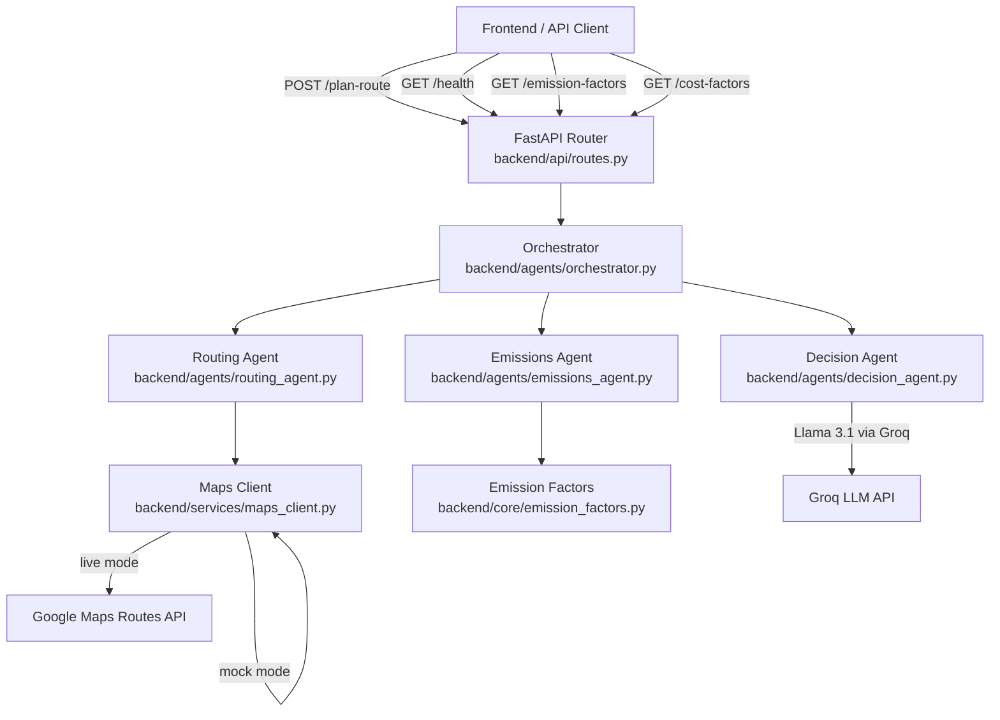

# Design: Core Data & Single-Route MVP (Phase 1.1)

## Overview

Phase 1.1 establishes the foundational route planning engine for PathProject — a carbon-aware multi-modal route planner. The system accepts an origin/destination pair, fetches routes across up to 11 transit modes, computes per-segment emissions and costs using EPA/IPCC/FTA emission factors, ranks results (greenest, fastest, cheapest), and returns a structured comparison via a REST API.

The architecture follows a linear multi-agent pipeline: **Routing Agent → Emissions Agent → Decision Agent**, orchestrated by a central coordinator. A mock routing engine provides deterministic data when no Google Maps API key is available, enabling full-stack development without external dependencies.

**Current State:** Most of Phase 1.1 is already implemented. The design below documents the existing architecture and identifies gaps that need to be filled to satisfy all requirements.

### What Exists

| Component | File | Status |
|---|---|---|
| FastAPI app with CORS | `backend/main.py` | ✅ Complete |
| `/health` and `/plan-route` endpoints | `backend/api/routes.py` | ✅ Complete |
| Multi-modal route fetching with distance filters | `backend/agents/routing_agent.py` | ✅ Complete |
| Emissions/cost computation, ranking | `backend/agents/emissions_agent.py` | ✅ Complete |
| Settings with env vars | `backend/core/config.py` | ✅ Complete |
| 11 transit modes, emission/cost factors | `backend/core/emission_factors.py` | ✅ Complete |
| Pydantic request/response models | `backend/models/schemas.py` | ✅ Complete |
| Google Maps Routes API client with mock fallback | `backend/services/maps_client.py` | ✅ Complete |
| Orchestrator pipeline | `backend/agents/orchestrator.py` | ✅ Complete |
| Decision agent (LLM via Groq) | `backend/agents/decision_agent.py` | ✅ Complete |

### What's Missing

| Gap | Requirement | Description |
|---|---|---|
| `GET /api/v1/emission-factors` | Req 11.1 | Endpoint returning all emission factors with provenance |
| `GET /api/v1/cost-factors` | Req 11.2 | Endpoint returning all cost factors with provenance |
| Input validation for empty origin/destination | Req 6.3, 6.4, 8.1–8.4 | Pydantic validators + structured error responses |
| Structured error responses | Req 8.3, 8.4 | Global exception handler returning safe JSON errors |

## Architecture

The system uses a layered agent architecture with a linear DAG pipeline:



### Request Flow (POST /plan-route)

1. **API Layer** validates the `RouteRequest` (origin, destination, optional modes/constraint)
2. **Orchestrator** coordinates the three-stage pipeline
3. **Routing Agent** calls `Maps Client` for each transit mode, filters by distance thresholds (walking > 8 km, bicycling > 25 km)
4. **Emissions Agent** computes per-segment emissions and costs using the emission/cost factor tables, then identifies greenest/fastest/cheapest
5. **Decision Agent** sends structured route data to Llama 3.1 via Groq for natural-language reasoning (falls back to deterministic pick if unavailable)
6. **Orchestrator** assembles the `RouteComparison` response sorted by emissions ascending

### Key Design Decisions

- **Mock-first development**: The mock routing engine uses deterministic seeding (MD5 of origin|destination) so results are repeatable. Haversine distance estimation is used when lat/lng pairs are provided.
- **Multi-segment transit routes**: Transit modes (bus, light_rail, subway, commuter_rail) generate walk→transit→walk segments. Non-transit modes produce a single segment.
- **Graceful degradation**: Live API failures fall back to mock. Missing Groq key falls back to deterministic greenest-pick reasoning.
- **Emission factor provenance**: Every factor carries a `source` string citing EPA, IPCC, or FTA data, enabling transparency and auditability.

## Components and Interfaces

### 1. API Layer (`backend/api/routes.py`)

**Existing endpoints:**

- `GET /api/v1/health` → `HealthResponse`
- `POST /api/v1/plan-route` → `RouteComparison`

**New endpoints to add:**

- `GET /api/v1/emission-factors` → list of `EmissionFactorResponse`
- `GET /api/v1/cost-factors` → list of `CostFactorResponse`

**New error handling to add:**

- Global exception handler for unhandled errors → HTTP 500 with safe JSON body
- Pydantic `field_validator` on `RouteRequest.origin` and `RouteRequest.destination` to reject empty/whitespace-only strings → HTTP 422

### 2. Routing Agent (`backend/agents/routing_agent.py`)

**Interface (existing, no changes needed):**

```python
async def get_routes(
    origin: str,
    destination: str,
    modes: list[TransitMode] | None = None,
    routing_mode: str = "mock",
    api_key: str = "",
) -> list[RawRouteResult]
```

- Default modes: driving, light_rail, bus, bicycling, walking, rideshare
- Filters: walking > 8 km excluded, bicycling > 25 km excluded

### 3. Emissions Agent (`backend/agents/emissions_agent.py`)

**Interface (existing, no changes needed):**

```python
def analyze_route(raw: RawRouteResult) -> RouteOption
def analyze_all(raw_routes: list[RawRouteResult]) -> list[RouteOption]
def find_greenest(options: list[RouteOption]) -> RouteOption | None
def find_fastest(options: list[RouteOption]) -> RouteOption | None
def find_cheapest(options: list[RouteOption]) -> RouteOption | None
def savings_vs_driving(options: list[RouteOption]) -> float | None
```

- Per-segment emissions: `distance_km × g_co2e_per_pkm`
- Per-segment cost: `distance_km × per_km_cost`
- Base fare added once per route option for the primary mode

### 4. Maps Client (`backend/services/maps_client.py`)

**Interface (existing, no changes needed):**

```python
async def fetch_route(origin, destination, mode, routing_mode, api_key) -> RawRouteResult
async def fetch_all_routes(origin, destination, modes, routing_mode, api_key) -> list[RawRouteResult]
```

- Mock mode: deterministic seed from `MD5(origin|destination)`, haversine for lat/lng, hash-based distance for addresses
- Live mode: Google Maps Routes API v2 (`computeRoutes`), falls back to mock on error

### 5. Emission Factors (`backend/core/emission_factors.py`)

**Interface (existing, no changes needed):**

```python
def get_factor(mode: TransitMode) -> EmissionFactor
def get_cost_factor(mode: TransitMode) -> CostFactor
def compute_emissions_g(mode: TransitMode, distance_km: float) -> float
def compute_cost(mode: TransitMode, distance_km: float) -> float
```

- 11 transit modes with EPA/IPCC/FTA sourced factors
- All factors are `@dataclass(frozen=True)` for immutability

### 6. Configuration (`backend/core/config.py`)

**Interface (existing, no changes needed):**

```python
class Settings(BaseSettings):
    google_maps_api_key: str
    groq_api_key: str
    routing_mode: str  # "mock" | "live"
    cors_origins: list[str]
    # ...
```

## Data Models

### Existing Models (no changes needed)

```python
# Request
class RouteRequest(BaseModel):
    origin: str           # Starting address or lat,lng
    destination: str      # Ending address or lat,lng
    modes: list[TransitMode] | None  # None = all defaults
    constraint: str | None           # User constraint for decision agent

# Response
class RouteSegment(BaseModel):
    mode: TransitMode
    distance_km: float
    duration_min: float
    emissions_g: float
    cost_usd: float
    description: str

class RouteOption(BaseModel):
    mode: TransitMode
    segments: list[RouteSegment]
    total_distance_km: float
    total_duration_min: float
    total_emissions_g: float
    total_emissions_kg: float
    total_cost_usd: float
    emission_factor_source: str
    cost_source: str

class RouteComparison(BaseModel):
    origin: str
    destination: str
    options: list[RouteOption]
    greenest: RouteOption | None
    fastest: RouteOption | None
    cheapest: RouteOption | None
    savings_vs_driving_kg: float | None
    reasoning: AgentReasoning | None

class HealthResponse(BaseModel):
    status: str = "ok"
    routing_mode: str
    version: str = "0.1.0"
```

### New Models to Add

```python
# Validation: add field_validator to RouteRequest
class RouteRequest(BaseModel):
    origin: str
    destination: str
    # ... existing fields ...

    @field_validator("origin", "destination")
    @classmethod
    def must_not_be_empty(cls, v: str) -> str:
        if not v.strip():
            raise ValueError("must not be empty or whitespace-only")
        return v

# New response models for factor endpoints
class EmissionFactorResponse(BaseModel):
    mode: str
    g_co2e_per_pkm: float
    source: str
    notes: str = ""

class CostFactorResponse(BaseModel):
    mode: str
    base_fare: float
    per_km_cost: float
    source: str
    notes: str = ""

# Structured error response
class ErrorResponse(BaseModel):
    error: str
    detail: str | None = None
```

### Internal Data Structures (existing, no changes)

```python
# Emission factor table entry
@dataclass(frozen=True)
class EmissionFactor:
    mode: TransitMode
    g_co2e_per_pkm: float
    source: str
    notes: str = ""

# Cost factor table entry
@dataclass(frozen=True)
class CostFactor:
    mode: TransitMode
    base_fare: float
    per_km_cost: float
    source: str
    notes: str = ""

# Raw route from maps client
@dataclass
class RawRouteResult:
    mode: TransitMode
    distance_km: float
    duration_min: float
    segments: list[dict]
```


## Correctness Properties

*A property is a characteristic or behavior that should hold true across all valid executions of a system — essentially, a formal statement about what the system should do. Properties serve as the bridge between human-readable specifications and machine-verifiable correctness guarantees.*

### Property 1: Emissions computation formula

*For any* `TransitMode` and *any* positive `distance_km`, `compute_emissions_g(mode, distance_km)` SHALL equal `distance_km × EMISSION_FACTORS[mode].g_co2e_per_pkm`.

**Validates: Requirements 3.1, 3.5**

### Property 2: Cost computation formula

*For any* `TransitMode` and *any* positive `distance_km`, `compute_cost(mode, distance_km)` SHALL equal `distance_km × COST_FACTORS[mode].per_km_cost`.

**Validates: Requirements 4.1, 4.4**

### Property 3: Total emissions equals sum of segment emissions

*For any* `RawRouteResult` with one or more segments, the `total_emissions_g` of the resulting `RouteOption` SHALL equal the sum of `emissions_g` across all its `RouteSegment` entries (within floating-point rounding tolerance).

**Validates: Requirements 3.2**

### Property 4: Total cost equals sum of segment costs plus base fare

*For any* `RawRouteResult`, the `total_cost_usd` of the resulting `RouteOption` SHALL equal the sum of all segment `cost_usd` values plus the `base_fare` of the primary mode's `CostFactor` (within floating-point rounding tolerance).

**Validates: Requirements 4.2**

### Property 5: Gram-to-kilogram conversion invariant

*For any* `RawRouteResult`, the resulting `RouteOption` SHALL satisfy `total_emissions_kg == round(total_emissions_g / 1000.0, 3)`.

**Validates: Requirements 3.3**

### Property 6: Non-negative computation outputs

*For any* `TransitMode` and *any* positive `distance_km`, `compute_emissions_g(mode, distance_km)` SHALL be ≥ 0 and `compute_cost(mode, distance_km)` SHALL be ≥ 0.

**Validates: Requirements 3.6, 4.5**

### Property 7: Segment structure by mode type

*For any* transit mode in {bus, light_rail, subway, commuter_rail} and *any* positive distance, the mock route SHALL produce exactly 3 segments with modes [walking, transit_mode, walking]. *For any* mode in {driving, walking, bicycling, e_scooter, rideshare} and *any* positive distance, the mock route SHALL produce exactly 1 segment.

**Validates: Requirements 2.1, 2.2**

### Property 8: Segment distance sum invariant

*For any* mock-generated `RawRouteResult`, the sum of all segment `distance_km` values SHALL equal the route's `distance_km` (within floating-point rounding tolerance).

**Validates: Requirements 2.3**

### Property 9: Mock routing determinism

*For any* origin string and *any* destination string and *any* `TransitMode`, calling `mock_route(origin, destination, mode)` twice SHALL produce identical `distance_km`, `duration_min`, and segment data.

**Validates: Requirements 1.3**

### Property 10: Distance-based mode filtering

*For any* origin and destination where the computed walking distance exceeds 8 km, the `Routing_Agent` SHALL exclude walking from results. *For any* origin and destination where the computed bicycling distance exceeds 25 km, the `Routing_Agent` SHALL exclude bicycling from results.

**Validates: Requirements 1.6, 1.7**

### Property 11: Ranking correctness

*For any* non-empty list of `RouteOption` objects, `find_greenest` SHALL return the option with the minimum `total_emissions_g`, `find_fastest` SHALL return the option with the minimum `total_duration_min`, and `find_cheapest` SHALL return the option with the minimum `total_cost_usd`.

**Validates: Requirements 5.2, 5.3, 5.4**

### Property 12: Savings vs driving computation

*For any* list of `RouteOption` objects that includes a driving option, `savings_vs_driving` SHALL return `round((driving.total_emissions_g - greenest.total_emissions_g) / 1000.0, 3)`. *For any* list without a driving option, it SHALL return `None`.

**Validates: Requirements 5.5, 5.6**

### Property 13: Factor table completeness and integrity

*For every* member of the `TransitMode` enum, there SHALL exist an entry in `EMISSION_FACTORS` with a non-negative `g_co2e_per_pkm` and a non-empty `source` string, and an entry in `COST_FACTORS` with non-negative `per_km_cost` and `base_fare` and a non-empty `source` string.

**Validates: Requirements 9.1, 9.2, 9.3, 9.4, 9.5, 9.6**

### Property 14: Source provenance attached to route options

*For any* `RawRouteResult`, the resulting `RouteOption` SHALL have a non-empty `emission_factor_source` matching `EMISSION_FACTORS[mode].source` and a non-empty `cost_source` matching `COST_FACTORS[mode].source`.

**Validates: Requirements 3.4, 4.3**

### Property 15: Empty/whitespace origin or destination rejection

*For any* string composed entirely of whitespace (including the empty string), submitting it as `origin` or `destination` in a `RouteRequest` SHALL raise a validation error.

**Validates: Requirements 6.3**

### Property 16: Emissions sort order

*For any* set of route options returned by the orchestrator, the `options` list in the `RouteComparison` SHALL be sorted by `total_emissions_g` in ascending order.

**Validates: Requirements 5.1**

## Error Handling

### Existing Error Handling

| Scenario | Current Behavior | Status |
|---|---|---|
| Google Maps API failure | Falls back to mock routing, logs warning | ✅ Implemented |
| Missing Groq API key | Falls back to deterministic greenest-pick reasoning | ✅ Implemented |
| Unknown segment mode string | Falls back to `TransitMode.WALKING` | ✅ Implemented |

### Error Handling to Add

| Scenario | Required Behavior | Requirement |
|---|---|---|
| Empty/whitespace origin or destination | HTTP 422 with field-level validation error | Req 6.3, 6.4, 8.1 |
| Invalid TransitMode enum value | HTTP 422 with list of valid modes (handled by Pydantic/FastAPI) | Req 8.2 |
| Unhandled internal exception | HTTP 500 with generic `{"error": "Internal server error"}`, log full traceback server-side | Req 8.3 |
| Any error response | Must not contain stack traces or implementation details | Req 8.4 |

### Implementation Approach

1. **Input validation**: Add a `field_validator` to `RouteRequest` for `origin` and `destination` that rejects empty/whitespace-only strings. FastAPI will automatically return HTTP 422 with Pydantic's structured error format (field name + reason).

2. **Global exception handler**: Add a FastAPI exception handler for `Exception` in `main.py` that catches unhandled errors, logs the full traceback via Python's `logging` module, and returns a safe `{"error": "Internal server error"}` JSON response with HTTP 500.

3. **Pydantic enum validation**: Already handled by FastAPI/Pydantic — invalid enum values in the request body produce HTTP 422 with the valid values listed.

## Testing Strategy

### Property-Based Testing

This feature is well-suited for property-based testing. The core computation functions (`compute_emissions_g`, `compute_cost`, `analyze_route`, `find_greenest`, etc.) are pure functions with clear input/output behavior and universal properties that hold across a wide input space.

**Library**: [Hypothesis](https://hypothesis.readthedocs.io/) for Python

**Configuration**: Minimum 100 iterations per property test.

**Tag format**: `Feature: core-route-mvp, Property {number}: {property_text}`

Each correctness property (1–16) maps to one property-based test. Generators will produce:
- Random `TransitMode` values (sampled from the enum)
- Random positive `distance_km` floats (e.g., 0.1 to 100.0)
- Random origin/destination strings
- Random `RawRouteResult` objects with valid segment structures
- Random lists of `RouteOption` objects for ranking tests

### Unit Tests (Example-Based)

| Test | Requirement | Description |
|---|---|---|
| Default modes when none specified | Req 1.2 | Verify default mode set is {driving, light_rail, bus, bicycling, walking, rideshare} |
| Live API fallback on error | Req 1.5 | Mock API exception, verify mock data returned |
| Health endpoint returns 200 | Req 7.1 | GET /health, verify status "ok" |
| Health includes routing_mode | Req 7.2 | Verify routing_mode field present |
| Health includes version | Req 7.3 | Verify version field present |
| Pydantic validation error format | Req 8.1 | Send invalid body, verify 422 with field details |
| Invalid mode returns 422 | Req 8.2 | Send invalid mode string, verify 422 |
| Internal error returns 500 | Req 8.3 | Mock internal error, verify generic 500 response |
| No stack traces in errors | Req 8.4 | Trigger errors, verify no traces in response |
| CORS configured | Req 10.1 | Verify CORS middleware present |
| API key not in responses | Req 10.3 | Make API calls, verify key absent from responses |
| Emission factors endpoint | Req 11.1 | GET /emission-factors, verify all 11 modes present |
| Cost factors endpoint | Req 11.2 | GET /cost-factors, verify all 11 modes present |
| Bar chart data in response | Req 11.3 | Verify per-option emissions/cost/duration fields |
| Savings metric present | Req 11.4 | Verify savings_vs_driving_kg when driving included |

### Integration Tests

| Test | Requirement | Description |
|---|---|---|
| Full plan-route pipeline (mock) | Req 6.1, 6.2 | POST /plan-route with valid input, verify full RouteComparison shape |
| Live Google Maps API call | Req 1.4 | (Manual/CI-only) Verify live API returns distance and duration |

### Test Organization

```
backend/
  tests/
    test_emission_factors.py    # Properties 1, 2, 6, 13, factor table integrity
    test_emissions_agent.py     # Properties 3, 4, 5, 11, 12, 14, route analysis
    test_maps_client.py         # Properties 7, 8, 9, segment structure + determinism
    test_routing_agent.py       # Property 10, distance filtering
    test_ranking.py             # Properties 11, 16, ranking + sorting
    test_validation.py          # Property 15, input validation
    test_api.py                 # Unit tests for endpoints, error handling, CORS
```
