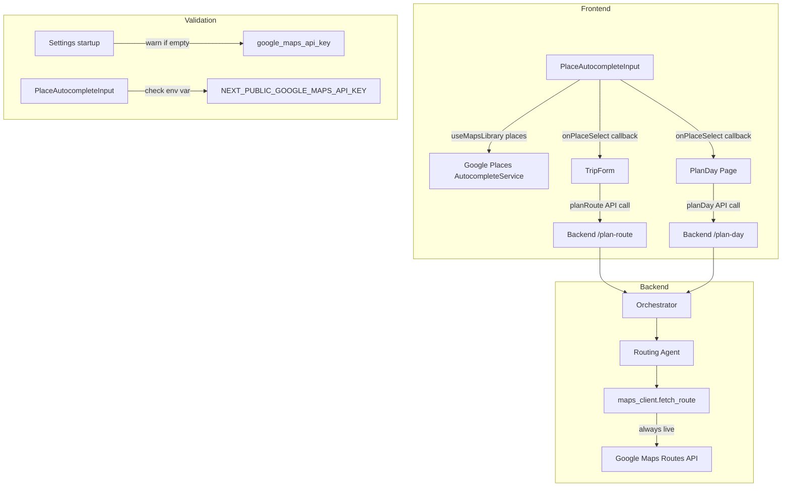

# Design Document: Location Autocomplete

## Overview

This design replaces all plain-text location inputs in the PathProject frontend with Google Maps Places Autocomplete and removes the mock routing mode from the backend. The changes span three areas:

1. **Frontend autocomplete component** — A reusable `PlaceAutocompleteInput` React component that wraps the Google Maps Places library, providing address suggestions as users type. It is used in both the TripForm (origin/destination) and the Plan Day page (home address).
2. **Mock routing removal** — The backend `maps_client.py` mock routing engine (`mock_route`, `_deterministic_seed`, `_haversine_estimate`, `_MOCK_SPEEDS`, `_DETOUR`, `_build_transit_segments` for mock) and the `routing_mode` config field are removed. The `fetch_route` function calls the Google Maps Routes API directly and raises on failure instead of falling back.
3. **API key validation** — Both frontend and backend validate that a Google Maps API key is present at startup/load time, with graceful degradation on the frontend (falls back to plain text input) and a warning log on the backend.

### Key Design Decision: Google Places API Version

As of March 2025, Google deprecated `google.maps.places.Autocomplete` for new customers and recommends `google.maps.places.PlaceAutocompleteElement`. However, the existing project uses `@vis.gl/react-google-maps` which provides `useMapsLibrary('places')` to access the Places library. Since the project may already have an active API key with legacy access, and the `@vis.gl/react-google-maps` autocomplete example uses the classic `Autocomplete` class, we will use the classic `google.maps.places.Autocomplete` approach via `useMapsLibrary`. If the API key is new (post-March 2025), the implementation can be swapped to use `PlaceAutocompleteElement` with minimal changes since the component encapsulates this detail.

### Key Design Decision: Custom Dropdown vs Native Autocomplete Widget

We build a **custom dropdown** rather than relying on the native Google Autocomplete widget. This gives us full control over keyboard navigation, ARIA attributes, styling consistency with the existing Tailwind design system, and the ability to show "No results found" messages. The component uses `AutocompleteService.getPlacePredictions()` for suggestions and `PlacesService.getDetails()` for resolving a selected prediction to a formatted address.

## Architecture



### Data Flow

1. User types in `PlaceAutocompleteInput` → after 2+ characters, `AutocompleteService.getPlacePredictions()` is called
2. Suggestions render in a custom dropdown (max 5) with keyboard navigation and ARIA attributes
3. User selects a suggestion → `PlacesService.getDetails()` resolves the `place_id` to a `formatted_address`
4. The formatted address string is passed up via `onPlaceSelect` callback to the parent form
5. On form submit, the formatted address string is sent to the backend API (same as today — origin/destination are strings)
6. Backend routes the request through the orchestrator → routing agent → `maps_client.fetch_route` → Google Maps Routes API (no mock path)

## Components and Interfaces

### Frontend Components

#### PlaceAutocompleteInput

A reusable React component that provides Google Places autocomplete functionality.

```typescript
interface PlaceAutocompleteInputProps {
  /** Current value of the input field */
  value: string;
  /** Callback when the text input changes (for controlled input) */
  onChange: (value: string) => void;
  /** Callback when a place is selected from suggestions */
  onPlaceSelect: (place: { formattedAddress: string; placeId: string } | null) => void;
  /** Placeholder text */
  placeholder?: string;
  /** HTML id attribute */
  id?: string;
  /** Additional CSS classes */
  className?: string;
  /** Whether the input is required */
  required?: boolean;
  /** Label text for accessibility */
  label?: string;
}
```

**Internal state:**
- `suggestions`: array of `google.maps.places.AutocompletePrediction` (max 5)
- `isOpen`: whether the dropdown is visible
- `highlightedIndex`: index of the keyboard-highlighted suggestion (-1 = none)
- `isLoading`: whether a prediction request is in flight

**Behavior:**
- Queries `AutocompleteService.getPlacePredictions()` when input has ≥ 2 characters (debounced ~300ms)
- Displays up to 5 suggestions in a dropdown
- On selection, calls `PlacesService.getDetails()` to get `formatted_address`, then calls `onPlaceSelect`
- On clear (empty input), calls `onPlaceSelect(null)` and closes dropdown
- On API failure, allows manual text entry without blocking
- If no API key is available, renders as a standard text input

**Keyboard navigation:**
- `ArrowDown` / `ArrowUp`: move highlight through suggestions
- `Enter`: select highlighted suggestion (or submit form if no suggestion highlighted)
- `Escape`: close dropdown without selecting

**ARIA attributes:**
- Input: `role="combobox"`, `aria-expanded`, `aria-activedescendant`, `aria-autocomplete="list"`, `aria-controls`
- Dropdown: `role="listbox"`, `id` matching `aria-controls`
- Each suggestion: `role="option"`, `id` for `aria-activedescendant`, `aria-selected`

#### TripForm Changes

- Replace the origin `<input>` with `<PlaceAutocompleteInput>` bound to `origin` state
- Replace the destination `<input>` with `<PlaceAutocompleteInput>` bound to `destination` state
- On submit, send `origin` and `destination` as formatted address strings (no change to API contract)

#### PlanDay Page Changes

- Replace the home address `<input>` with `<PlaceAutocompleteInput>` bound to `homeAddress` state
- On submit, send `home_address` as formatted address string (no change to API contract)

#### APIProvider Placement

The `PlaceAutocompleteInput` component uses `useMapsLibrary('places')` which requires an `<APIProvider>` ancestor. Currently, `APIProvider` only wraps the `MapView` component. Two options:

**Chosen approach:** Wrap the `PlaceAutocompleteInput` internally with its own `<APIProvider>` only when it detects no parent provider. This keeps the component self-contained and avoids restructuring the app layout. The API key is read from `process.env.NEXT_PUBLIC_GOOGLE_MAPS_API_KEY`.

### Backend Changes

#### config.py (Settings)

- Remove `routing_mode: str = "mock"` field
- Add startup validation: if `google_maps_api_key` is empty, log a warning

#### maps_client.py

- Remove: `_deterministic_seed`, `_haversine_estimate`, `_MOCK_SPEEDS`, `_DETOUR`, `_build_transit_segments` (mock-only usage), `mock_route`
- Keep: `_build_transit_segments` (used by `live_route` for segment formatting), `live_route`, `_parse_latlng`, `_parse_duration`, `_MODE_TO_GOOGLE`, `ROUTES_API_URL`, `RawRouteResult`
- Modify `fetch_route`: remove `routing_mode` parameter, always call `live_route`, raise on failure (no mock fallback)
- Modify `fetch_all_routes`: remove `routing_mode` parameter

#### routing_agent.py

- Remove `routing_mode` parameter from `get_routes`
- Pass only `api_key` to `fetch_all_routes`

#### orchestrator.py

- Remove `routing_mode` parameter from `plan_route` and `plan_day`
- Remove `routing_mode` from calls to `get_routes`

#### routes.py

- Remove `settings.routing_mode` from `plan_route` and `plan_day` endpoint calls
- Remove `routing_mode` from health endpoint response

#### schemas.py

- Remove `routing_mode` from `HealthResponse`

## Data Models

### Frontend Types

No new API types are needed. The `PlaceAutocompleteInput` component uses Google Maps types internally:

```typescript
// Internal to PlaceAutocompleteInput — not exported as API types
interface SelectedPlace {
  formattedAddress: string;
  placeId: string;
}
```

The existing `RouteRequest`, `DayPlanRequest`, and their response types remain unchanged. The origin, destination, and home_address fields continue to be plain strings.

### Backend Models

No schema changes to request/response models except:

```python
# HealthResponse — remove routing_mode
class HealthResponse(BaseModel):
    status: str = "ok"
    version: str = "0.1.0"
```

### Configuration Changes

```python
# Settings — remove routing_mode, add validation
class Settings(BaseSettings):
    # ... existing fields ...
    google_maps_api_key: str = ""
    # routing_mode field REMOVED
    
    @model_validator(mode='after')
    def validate_api_key(self) -> 'Settings':
        if not self.google_maps_api_key:
            import logging
            logging.getLogger(__name__).warning(
                "Google Maps API key is not configured. Route planning will fail."
            )
        return self
```


## Correctness Properties

*A property is a characteristic or behavior that should hold true across all valid executions of a system — essentially, a formal statement about what the system should do. Properties serve as the bridge between human-readable specifications and machine-verifiable correctness guarantees.*

### Property 1: Character threshold triggers autocomplete query

*For any* input string, the autocomplete service SHALL be called if and only if the string has 2 or more non-empty characters. For strings with fewer than 2 characters, no query shall be made.

**Validates: Requirements 1.1**

### Property 2: Suggestion count is capped at 5

*For any* array of place suggestions returned by the Places API (of any length 0–N), the component SHALL display at most 5 suggestions. The displayed count equals `min(suggestions.length, 5)`.

**Validates: Requirements 1.2**

### Property 3: Selection populates input and closes dropdown

*For any* list of suggestions and any valid selection index, selecting a suggestion SHALL set the input value to the formatted address of that suggestion AND close the dropdown.

**Validates: Requirements 1.3, 1.4**

### Property 4: Form submission preserves selected addresses

*For any* pair of formatted address strings selected via autocomplete, submitting the form SHALL include those exact strings in the API request payload (as origin/destination or home_address).

**Validates: Requirements 2.2, 3.2**

### Property 5: All route fetching uses live API

*For any* origin, destination, and transit mode combination, `fetch_route` SHALL call the Google Maps Routes API (live_route). There is no mock code path.

**Validates: Requirements 4.3, 4.4**

### Property 6: API errors propagate without mock fallback

*For any* error raised by the Google Maps Routes API (timeout, HTTP 4xx, HTTP 5xx, network error), `fetch_route` SHALL raise an exception to the caller rather than returning synthetic data.

**Validates: Requirements 4.5**

### Property 7: Keyboard navigation keeps highlight in bounds with correct ARIA state

*For any* list of suggestions (length 1–5) and any sequence of ArrowUp/ArrowDown key presses, the highlighted index SHALL remain within `[0, suggestions.length - 1]`. The highlighted suggestion SHALL have `aria-selected="true"`, and pressing Enter SHALL select the currently highlighted suggestion.

**Validates: Requirements 6.1, 6.2, 6.3**

## Error Handling

### Frontend

| Scenario | Behavior |
|---|---|
| Google Maps API key missing (`NEXT_PUBLIC_GOOGLE_MAPS_API_KEY` empty) | `PlaceAutocompleteInput` renders as a standard text input. No autocomplete functionality. User can type addresses manually. |
| Places API returns zero results | Dropdown shows "No results found" message. Input remains editable. |
| Places API request fails (network error, quota exceeded) | Error is caught silently. Dropdown closes. User can continue typing manually. No error toast or blocking UI. |
| `PlacesService.getDetails()` fails after selection | The prediction's `description` field is used as a fallback address string. |
| User submits form without selecting a suggestion | The raw text in the input field is sent as the address string (same behavior as current plain text inputs). |

### Backend

| Scenario | Behavior |
|---|---|
| `google_maps_api_key` is empty at startup | `Settings` validator logs a warning: "Google Maps API key is not configured. Route planning will fail." Application still starts (other features like calendar may work). |
| Google Maps Routes API call fails | `fetch_route` raises the exception (e.g., `httpx.HTTPStatusError`, `httpx.TimeoutException`). The routing agent propagates it. The API endpoint returns an HTTP 502 or 500 with error details. |
| Google Maps Routes API returns unexpected response shape | `KeyError` or `IndexError` propagates up. API endpoint returns HTTP 500. |
| Invalid origin/destination address | Google Maps Routes API returns an error. Propagated to caller as above. |

## Testing Strategy

### Unit Tests (Example-Based)

These cover specific scenarios, edge cases, and integration points:

**Frontend:**
- `PlaceAutocompleteInput` renders as plain input when API key is missing (Req 5.4)
- "No results found" message displays when API returns empty results (Req 1.6)
- Input remains functional when Places API fails (Req 1.7)
- Clearing input resets selected place data (Req 1.5)
- Escape key closes dropdown without selecting (Req 6.4)
- ARIA attributes are present: `role="combobox"`, `aria-expanded`, `aria-activedescendant`, `role="listbox"` (Req 6.5)
- TripForm renders PlaceAutocompleteInput for origin and destination (Req 2.1)
- TripForm initializes with empty inputs and placeholder text (Req 2.3)
- PlanDay page renders PlaceAutocompleteInput for home address (Req 3.1)

**Backend:**
- `Settings` without `routing_mode` field (Req 4.1)
- Mock functions are removed from `maps_client` (Req 4.2)
- Health endpoint response has no `routing_mode` (Req 4.7)
- API routes don't pass `routing_mode` to orchestrator (Req 4.6)
- `Settings` logs warning when `google_maps_api_key` is empty (Req 5.1, 5.2)

### Property-Based Tests

Property-based tests verify universal properties across many generated inputs. Each test runs a minimum of 100 iterations.

| Property | Test Description | Library |
|---|---|---|
| Property 1: Character threshold | Generate random strings (0–100 chars). Assert query is called iff length ≥ 2. | fast-check (TypeScript) |
| Property 2: Suggestion cap | Generate random arrays of predictions (0–20 items). Assert displayed count = min(length, 5). | fast-check (TypeScript) |
| Property 3: Selection populates and closes | Generate random prediction lists (1–5) and random index. Assert input value matches and dropdown closes. | fast-check (TypeScript) |
| Property 4: Form preserves addresses | Generate random address string pairs. Assert API payload contains exact strings. | fast-check (TypeScript) |
| Property 5: Live API always called | Generate random (origin, destination, mode) tuples. Mock httpx. Assert live_route is called, never mock_route. | Hypothesis (Python) |
| Property 6: Error propagation | Generate random error types. Mock httpx to raise. Assert fetch_route raises, never returns mock data. | Hypothesis (Python) |
| Property 7: Keyboard navigation bounds | Generate random suggestion lists (1–5) and random ArrowUp/ArrowDown sequences (1–50 presses). Assert highlight stays in bounds and aria-selected is correct. | fast-check (TypeScript) |

**Test tagging format:** Each property test includes a comment: `// Feature: location-autocomplete, Property {N}: {title}`

**Libraries:**
- Frontend: [fast-check](https://github.com/dubzzz/fast-check) for TypeScript property-based testing
- Backend: [Hypothesis](https://hypothesis.readthedocs.io/) for Python property-based testing
