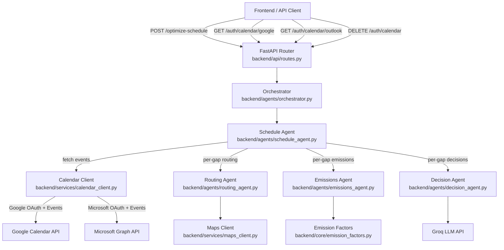
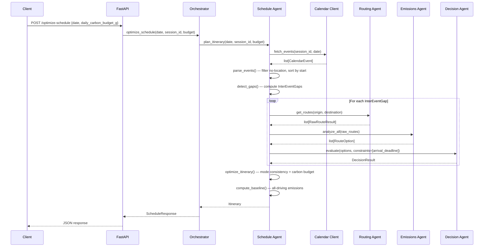
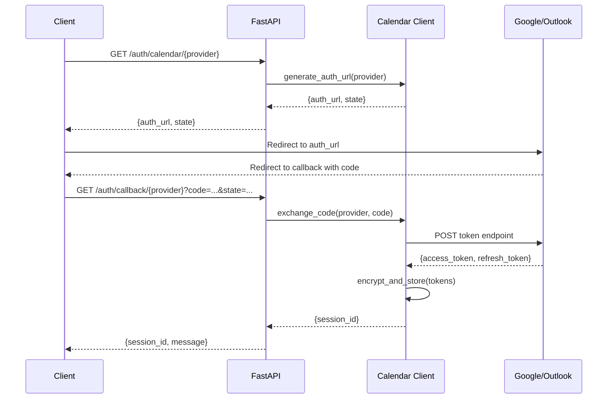

# Design: Schedule Orchestration (Phase 1.3)

## Overview

Phase 1.3 adds full-day itinerary planning via OAuth-connected calendars. The system ingests a user's calendar events (Google Calendar or Microsoft Outlook), detects inter-event gaps, and uses the existing multi-agent pipeline to optimize sustainable transit for each transition. A new Schedule Agent orchestrates route optimization across the full day rather than treating each gap independently.

This phase builds on:
- **Phase 1.1** (core-route-mvp): Routing Agent, Emissions Agent, Maps Client, emission/cost factor tables
- **Phase 1.2** (agentic-reasoning-layer): Decision Agent with constraint-based evaluation, Orchestrator's `plan_route_constrained`, `UserConstraint` model, weighted scoring

### What Exists (partial implementations from earlier work)

| Component | File | Status |
|---|---|---|
| Google Calendar OAuth flow (Google only) | `backend/services/calendar_client.py` | ⚠️ Partial — Google only, no Outlook, no encryption, in-memory token store |
| Calendar event models | `backend/models/schemas.py` | ⚠️ Partial — `CalendarEvent`, `TransitWindow`, `DayPlanResponse` exist but lack itinerary-level fields |
| Day planning endpoint | `backend/api/routes.py` | ⚠️ Partial — `/plan-day` exists but no `/optimize-schedule`, no carbon budget, no itinerary optimization |
| Day planning orchestration | `backend/agents/orchestrator.py` | ⚠️ Partial — `plan_day` exists but treats gaps independently, no holistic optimization |
| Mock calendar data | `backend/services/calendar_client.py` | ✅ Complete — `mock_events()` with ASU/Phoenix locations |

### What's New in This Design

| Component | File | Description |
|---|---|---|
| Outlook OAuth support | `backend/services/calendar_client.py` | Microsoft OAuth 2.0 flow + Graph API event fetching |
| Token encryption at rest | `backend/services/calendar_client.py` | Fernet-based encryption for stored OAuth tokens |
| Token revocation | `backend/services/calendar_client.py` | Endpoint to revoke access and delete stored tokens |
| Schedule Agent | `backend/agents/schedule_agent.py` | Event ingestion, gap detection, itinerary-level optimization, carbon budget distribution |
| Itinerary optimization | `backend/agents/schedule_agent.py` | Mode consistency, daily carbon budget, all-driving baseline comparison |
| New Pydantic models | `backend/models/schemas.py` | `ScheduleRequest`, `ScheduleResponse`, `InterEventGap`, `Itinerary`, `OAuthCallbackRequest`, etc. |
| `POST /api/v1/optimize-schedule` | `backend/api/routes.py` | Full-day schedule optimization endpoint |
| `GET /api/v1/auth/calendar/{provider}` | `backend/api/routes.py` | Provider-agnostic OAuth initiation |
| `GET /api/v1/auth/callback/{provider}` | `backend/api/routes.py` | Provider-agnostic OAuth callback |
| `DELETE /api/v1/auth/calendar` | `backend/api/routes.py` | Token revocation endpoint |

### Design Decisions

- **Provider-agnostic OAuth**: The calendar client abstracts Google and Outlook behind a common interface (`CalendarProvider` protocol). The OAuth endpoints use a `{provider}` path parameter rather than separate routes per provider. This keeps the API surface small and makes adding future providers straightforward.
- **Schedule Agent as a new agent**: Rather than extending the existing orchestrator's `plan_day`, a dedicated Schedule Agent handles itinerary-level concerns (gap detection, carbon budget distribution, mode consistency). The orchestrator delegates to it, keeping responsibilities clean.
- **Fernet encryption for tokens**: OAuth tokens are encrypted at rest using Python's `cryptography.fernet` module with a server-side key from the `TOKEN_ENCRYPTION_KEY` environment variable. This is simple, well-audited, and sufficient for the in-memory/session-scoped token store. A production deployment would use a database with column-level encryption.
- **Itinerary optimization is heuristic, not combinatorial**: Full combinatorial optimization across N gaps × M modes is exponential. Instead, the Schedule Agent uses a greedy approach: run the constrained pipeline per gap, then apply a post-processing pass for mode consistency and carbon budget enforcement. This keeps latency manageable while still producing globally-aware results.
- **Backward compatibility**: The existing `/plan-day` and `/auth/google` endpoints continue to work. The new `/optimize-schedule` and `/auth/calendar/{provider}` endpoints are additive.

## Architecture



### Schedule Optimization Request Flow



### OAuth Flow (Provider-Agnostic)



## Components and Interfaces

### 1. Calendar Client (`backend/services/calendar_client.py`)

The existing Google-only client is extended to support Outlook and add token encryption.

**New/modified public functions:**

```python
# --- Provider-agnostic OAuth ---

def generate_auth_url(
    provider: str,
    client_id: str,
    redirect_uri: str,
) -> tuple[str, str]:
    """
    Build the OAuth2 authorization URL for the given provider.
    
    Args:
        provider: "google" or "outlook"
        client_id: OAuth client ID for the provider
        redirect_uri: Callback URL
    
    Returns:
        (auth_url, state) — redirect user to auth_url
    """

async def exchange_code_for_tokens(
    provider: str,
    code: str,
    client_id: str,
    client_secret: str,
    redirect_uri: str,
    encryption_key: str = "",
) -> dict:
    """
    Exchange authorization code for tokens. Encrypts tokens before storage.
    
    Returns:
        {"session_id": str, "provider": str}
    """

async def refresh_access_token(
    session_id: str,
    client_id: str,
    client_secret: str,
    encryption_key: str = "",
) -> str:
    """Refresh an expired access token using the stored refresh token."""

async def fetch_events(
    session_id: str,
    target_date: date,
    client_id: str = "",
    client_secret: str = "",
    encryption_key: str = "",
) -> list[dict]:
    """
    Fetch calendar events for a date from the provider associated with the session.
    Handles token refresh transparently.
    
    Returns list of dicts: {summary, location, start, end}
    """

def revoke_session(session_id: str) -> bool:
    """
    Delete stored tokens for a session. Returns True if session existed.
    """

def get_session(session_id: str) -> dict | None:
    """Check if a session exists and return its metadata (provider, not tokens)."""

# --- Token encryption ---

def _encrypt_token(token: str, key: str) -> str:
    """Encrypt a token string using Fernet symmetric encryption."""

def _decrypt_token(encrypted: str, key: str) -> str:
    """Decrypt a Fernet-encrypted token string."""
```

**Outlook-specific constants:**

```python
MICROSOFT_AUTH_URL = "https://login.microsoftonline.com/common/oauth2/v2.0/authorize"
MICROSOFT_TOKEN_URL = "https://login.microsoftonline.com/common/oauth2/v2.0/token"
MICROSOFT_GRAPH_API = "https://graph.microsoft.com/v1.0"
OUTLOOK_SCOPES = "Calendars.Read offline_access"
```

### 2. Schedule Agent (`backend/agents/schedule_agent.py`)

New agent responsible for itinerary-level orchestration.

**Public functions:**

```python
def parse_events(raw_events: list[dict]) -> list[CalendarEvent]:
    """
    Parse raw event dicts into CalendarEvent models.
    Excludes events without a location field.
    Sorts by start time ascending.
    
    Returns:
        (parsed_events, excluded_summaries)
    """

def detect_gaps(
    events: list[CalendarEvent],
) -> list[InterEventGap]:
    """
    Compute inter-event gaps from a sorted list of calendar events.
    
    For each consecutive pair of events with locations:
    - Computes available_minutes = (next.start - current.end)
    - Flags gaps < 5 minutes as infeasible
    
    Returns list of InterEventGap objects.
    """

async def plan_gap_route(
    gap: InterEventGap,
    routing_mode: str = "mock",
    google_maps_api_key: str = "",
    groq_api_key: str = "",
) -> GapRouteResult:
    """
    Run the full agent pipeline for a single inter-event gap.
    Applies an implicit arrival deadline constraint.
    
    Returns GapRouteResult with the route comparison and recommended option.
    """

def optimize_itinerary(
    gap_results: list[GapRouteResult],
    daily_carbon_budget_g: float | None = None,
) -> list[GapRouteResult]:
    """
    Post-processing pass for itinerary-level optimization:
    1. Mode consistency: if driving is chosen for gap N and the next gap
       starts from the same location, prefer driving for gap N+1 if viable.
    2. Carbon budget: distribute budget across gaps, flag/swap transitions
       that would exceed remaining budget.
    
    Returns optimized list of GapRouteResults (may have different recommendations).
    """

def compute_all_driving_baseline(
    gaps: list[InterEventGap],
    routing_mode: str = "mock",
    google_maps_api_key: str = "",
) -> float:
    """
    Compute total emissions if all gaps were driven.
    Used for the savings comparison in the response.
    """

async def plan_itinerary(
    target_date: date,
    session_id: str | None = None,
    daily_carbon_budget_g: float | None = None,
    routing_mode: str = "mock",
    google_maps_api_key: str = "",
    google_client_id: str = "",
    google_client_secret: str = "",
    outlook_client_id: str = "",
    outlook_client_secret: str = "",
    encryption_key: str = "",
    groq_api_key: str = "",
) -> Itinerary:
    """
    Full itinerary planning pipeline:
    1. Fetch events from connected calendar (or mock)
    2. Parse and filter events
    3. Detect inter-event gaps
    4. Route each feasible gap via the agent pipeline
    5. Optimize itinerary (mode consistency + carbon budget)
    6. Compute all-driving baseline for comparison
    7. Assemble and return Itinerary
    """
```

### 3. Orchestrator (`backend/agents/orchestrator.py`)

A new `optimize_schedule` function delegates to the Schedule Agent.

**New public function:**

```python
async def optimize_schedule(
    target_date: date,
    session_id: str | None = None,
    daily_carbon_budget_g: float | None = None,
    routing_mode: str = "mock",
    google_maps_api_key: str = "",
    google_client_id: str = "",
    google_client_secret: str = "",
    outlook_client_id: str = "",
    outlook_client_secret: str = "",
    encryption_key: str = "",
    groq_api_key: str = "",
) -> ScheduleResponse:
    """
    Orchestrate full-day schedule optimization.
    Delegates to Schedule Agent's plan_itinerary.
    """
```

**Existing functions (unchanged):**

```python
async def plan_route(...) -> RouteComparison  # Phase 1.1
async def plan_day(...) -> DayPlanResponse     # Existing Phase 1.3 partial
```

### 4. API Layer (`backend/api/routes.py`)

**New endpoints:**

```python
@router.post("/optimize-schedule", response_model=ScheduleResponse)
async def optimize_schedule(
    req: ScheduleRequest,
    settings: Settings = Depends(get_settings),
) -> ScheduleResponse:
    """
    Full-day schedule optimization.
    Requires a connected calendar (session_id) or uses mock data.
    """

@router.get("/auth/calendar/{provider}", response_model=AuthUrlResponse)
async def auth_calendar(
    provider: str,
    settings: Settings = Depends(get_settings),
) -> AuthUrlResponse:
    """
    Initiate OAuth flow for the specified calendar provider.
    provider: "google" or "outlook"
    """

@router.get("/auth/callback/{provider}", response_model=AuthCallbackResponse)
async def auth_callback_provider(
    provider: str,
    code: str,
    state: str = "",
    settings: Settings = Depends(get_settings),
) -> AuthCallbackResponse:
    """
    OAuth callback for the specified provider.
    Exchanges code for tokens and returns a session_id.
    """

@router.delete("/auth/calendar", response_model=dict)
async def revoke_calendar(
    session_id: str,
) -> dict:
    """
    Revoke calendar access and delete stored tokens.
    """
```

**Existing endpoints (unchanged):**

```python
@router.get("/auth/google", ...)       # Phase 1.3 partial — preserved
@router.get("/auth/callback", ...)     # Phase 1.3 partial — preserved
@router.post("/plan-day", ...)         # Phase 1.3 partial — preserved
@router.post("/plan-route", ...)       # Phase 1.1
@router.get("/health", ...)            # Phase 1.1
```

### 5. Configuration (`backend/core/config.py`)

**New settings fields:**

```python
class Settings(BaseSettings):
    # ... existing fields ...
    
    # Microsoft OAuth (Outlook Calendar integration)
    outlook_client_id: str = ""
    outlook_client_secret: str = ""
    outlook_redirect_uri: str = "http://localhost:8000/api/v1/auth/callback/outlook"
    
    # Token encryption
    token_encryption_key: str = ""  # Fernet key for encrypting OAuth tokens at rest
```

## Data Models

### Existing Models (unchanged)

```python
class CalendarEvent(BaseModel):
    summary: str
    location: str
    start: str  # ISO 8601
    end: str    # ISO 8601

class TransitWindow(BaseModel): ...       # preserved for /plan-day backward compat
class DayPlanRequest(BaseModel): ...      # preserved
class DayPlanResponse(BaseModel): ...     # preserved
class RouteComparison(BaseModel): ...     # Phase 1.1
class RouteOption(BaseModel): ...         # Phase 1.1
class AuthUrlResponse(BaseModel): ...     # preserved
class AuthCallbackResponse(BaseModel): ... # preserved
```

### New Models

```python
class InterEventGap(BaseModel):
    """A time window between two calendar events where transit is needed."""
    from_event: CalendarEvent
    to_event: CalendarEvent
    origin: str = Field(..., description="Location of the ending event")
    destination: str = Field(..., description="Location of the starting event")
    depart_after: datetime = Field(..., description="Earliest departure (end of previous event)")
    arrive_by: datetime = Field(..., description="Latest arrival (start of next event)")
    available_minutes: float = Field(..., description="Total minutes available for transit")
    is_feasible: bool = Field(
        default=True,
        description="False if gap < 5 minutes",
    )


class GapRouteResult(BaseModel):
    """Route optimization result for a single inter-event gap."""
    gap: InterEventGap
    route_comparison: RouteComparison
    recommended_mode: TransitMode
    recommended_emissions_g: float
    recommended_duration_min: float
    recommended_cost_usd: float
    infeasible_reason: str | None = Field(
        default=None,
        description="Reason if gap was skipped (e.g., 'Gap shorter than 5 minutes')",
    )


class ItinerarySummary(BaseModel):
    """Aggregated metrics for the full-day itinerary."""
    total_emissions_g: float
    total_cost_usd: float
    total_transit_min: float
    all_driving_baseline_g: float = Field(
        ..., description="Total emissions if all gaps were driven"
    )
    savings_vs_driving_g: float = Field(
        ..., description="Emissions saved vs all-driving baseline"
    )
    carbon_budget_g: float | None = Field(
        default=None, description="Daily carbon budget if specified"
    )
    budget_remaining_g: float | None = Field(
        default=None, description="Remaining budget after optimized itinerary"
    )


class Itinerary(BaseModel):
    """A full-day plan with calendar events and optimized routes."""
    date: str
    events: list[CalendarEvent]
    excluded_events: list[str] = Field(
        default_factory=list,
        description="Summaries of events excluded due to missing location",
    )
    gaps: list[GapRouteResult]
    summary: ItinerarySummary
    mode_sequence: list[TransitMode] = Field(
        default_factory=list,
        description="Ordered list of recommended modes across all gaps",
    )


class ScheduleRequest(BaseModel):
    """Request model for POST /optimize-schedule."""
    date: str = Field(..., description="Date to optimize (YYYY-MM-DD)")
    session_id: str | None = Field(
        default=None,
        description="OAuth session ID. If omitted, uses mock calendar data.",
    )
    daily_carbon_budget_g: float | None = Field(
        default=None,
        ge=0,
        description="Optional daily carbon budget in grams CO2e.",
    )


class ScheduleResponse(BaseModel):
    """Response model for POST /optimize-schedule."""
    itinerary: Itinerary
    session_valid: bool = Field(
        default=True,
        description="Whether the calendar session is still valid",
    )
```

### Token Storage Structure (internal, not exposed via API)

```python
# In-memory store: session_id -> TokenRecord
@dataclass
class TokenRecord:
    provider: str                    # "google" or "outlook"
    encrypted_access_token: str      # Fernet-encrypted
    encrypted_refresh_token: str     # Fernet-encrypted
    expires_at: datetime | None
    created_at: datetime
```

### Gap Detection Logic

```python
# Pseudocode for detect_gaps
def detect_gaps(events: list[CalendarEvent]) -> list[InterEventGap]:
    gaps = []
    for i in range(len(events) - 1):
        current, next_ev = events[i], events[i + 1]
        if not current.location or not next_ev.location:
            continue
        
        depart = parse_datetime(current.end)
        arrive = parse_datetime(next_ev.start)
        available = (arrive - depart).total_seconds() / 60.0
        
        gap = InterEventGap(
            from_event=current,
            to_event=next_ev,
            origin=current.location,
            destination=next_ev.location,
            depart_after=depart,
            arrive_by=arrive,
            available_minutes=available,
            is_feasible=available >= 5.0,
        )
        gaps.append(gap)
    return gaps
```

### Itinerary Optimization Logic

```python
# Pseudocode for optimize_itinerary
def optimize_itinerary(gap_results, daily_carbon_budget_g=None):
    # Pass 1: Mode consistency
    for i in range(1, len(gap_results)):
        prev, curr = gap_results[i-1], gap_results[i]
        if prev.recommended_mode == TransitMode.DRIVING:
            # Check if driving is available and viable for current gap
            driving_option = find_driving_option(curr.route_comparison)
            if driving_option and fits_time_constraint(driving_option, curr.gap):
                curr.recommended_mode = TransitMode.DRIVING
                # Update emissions/cost/duration accordingly
    
    # Pass 2: Carbon budget enforcement
    if daily_carbon_budget_g is not None:
        remaining = daily_carbon_budget_g
        for result in gap_results:
            if result.recommended_emissions_g > remaining:
                # Try to find a greener alternative that fits
                greener = find_greener_option(result, remaining)
                if greener:
                    swap_recommendation(result, greener)
            remaining -= result.recommended_emissions_g
    
    return gap_results
```


## Correctness Properties

*A property is a characteristic or behavior that should hold true across all valid executions of a system — essentially, a formal statement about what the system should do. Properties serve as the bridge between human-readable specifications and machine-verifiable correctness guarantees.*

### Property 1: OAuth URL correctness

*For any* valid provider ("google" or "outlook"), *any* non-empty client_id, and *any* valid redirect_uri, the generated OAuth authorization URL SHALL contain the correct provider-specific base URL (Google's `accounts.google.com` or Microsoft's `login.microsoftonline.com`), the client_id as a query parameter, the redirect_uri as a query parameter, and the minimum required scope (`calendar.readonly` for Google, `Calendars.Read` for Outlook).

**Validates: Requirements 1.1, 1.6**

### Property 2: Token encryption round-trip

*For any* non-empty token string and *any* valid Fernet encryption key, encrypting the token with `_encrypt_token` and then decrypting with `_decrypt_token` SHALL produce the original token string. Furthermore, the encrypted representation SHALL NOT equal the original plaintext token.

**Validates: Requirements 1.3, 6.1**

### Property 3: Event parsing preserves fields

*For any* raw event dict containing non-empty `summary`, `location`, `start`, and `end` fields, `parse_events` SHALL return a `CalendarEvent` with matching `summary`, `location`, `start`, and `end` values.

**Validates: Requirements 2.2**

### Property 4: No-location events excluded

*For any* list of raw event dicts, `parse_events` SHALL exclude every event where the `location` field is empty or missing, and SHALL include every event where the `location` field is non-empty. The excluded event summaries SHALL be reported in the exclusion list.

**Validates: Requirements 2.3**

### Property 5: Events sorted by start time

*For any* list of raw event dicts with valid ISO 8601 start times, the list of `CalendarEvent` objects returned by `parse_events` SHALL be sorted by `start` time in ascending order.

**Validates: Requirements 2.4**

### Property 6: Gap detection correctness

*For any* list of two or more sorted `CalendarEvent` objects with locations, `detect_gaps` SHALL produce one `InterEventGap` per consecutive pair. Each gap's `available_minutes` SHALL equal `(next_event.start - current_event.end)` in minutes (within floating-point tolerance). Each gap with `available_minutes < 5.0` SHALL have `is_feasible == False`, and each gap with `available_minutes >= 5.0` SHALL have `is_feasible == True`.

**Validates: Requirements 3.1, 3.4**

### Property 7: Arrival deadline constraint correctness

*For any* `InterEventGap` with `is_feasible == True`, the arrival deadline `UserConstraint` constructed by `plan_gap_route` SHALL have `arrival_by` equal to the gap's `arrive_by` datetime.

**Validates: Requirements 3.3**

### Property 8: Total emissions aggregation

*For any* list of `GapRouteResult` objects, the `ItinerarySummary.total_emissions_g` SHALL equal the sum of `recommended_emissions_g` across all gap results (within floating-point tolerance). Similarly, `total_cost_usd` SHALL equal the sum of `recommended_cost_usd`, and `total_transit_min` SHALL equal the sum of `recommended_duration_min`.

**Validates: Requirements 3.5**

### Property 9: Itinerary completeness

*For any* set of input `CalendarEvent` objects and detected `InterEventGap` objects, the returned `Itinerary` SHALL contain all input events in its `events` list, and SHALL contain exactly one `GapRouteResult` for each gap where `is_feasible == True`. Infeasible gaps SHALL appear with `infeasible_reason` set.

**Validates: Requirements 3.6**

### Property 10: Mode consistency preference

*For any* sequence of two or more `GapRouteResult` objects where gap N recommends `DRIVING` and gap N+1 has `DRIVING` as a viable option (present in route_comparison.options and satisfying the time constraint), `optimize_itinerary` SHALL recommend `DRIVING` for gap N+1.

**Validates: Requirements 4.2**

### Property 11: Carbon budget enforcement

*For any* daily carbon budget and *any* sequence of `GapRouteResult` objects, after `optimize_itinerary` runs with the budget, the cumulative `recommended_emissions_g` across all gaps SHALL NOT exceed `daily_carbon_budget_g`, provided at least one mode per gap has emissions low enough to stay within budget. If no combination can satisfy the budget, the optimizer SHALL still minimize total emissions.

**Validates: Requirements 4.3**

### Property 12: Savings vs driving computation

*For any* `Itinerary`, the `savings_vs_driving_g` field in the `ItinerarySummary` SHALL equal `all_driving_baseline_g - total_emissions_g` (within floating-point tolerance).

**Validates: Requirements 4.4**

### Property 13: Session revocation completeness

*For any* stored session with a valid `session_id`, calling `revoke_session(session_id)` SHALL return `True`, and any subsequent call to `get_session(session_id)` SHALL return `None`.

**Validates: Requirements 6.3**

## Error Handling

### Existing Error Handling (from Phase 1.1 and 1.2, unchanged)

| Scenario | Behavior |
|---|---|
| Google Maps API failure | Falls back to mock routing |
| Missing Groq API key | Falls back to deterministic template-based justification |
| Unknown segment mode string | Falls back to `TransitMode.WALKING` emissions |
| All route options filtered by constraints | Returns closest viable options + `unmet_constraints` list |

### New Error Handling (Phase 1.3)

| Scenario | Behavior | Requirement |
|---|---|---|
| OAuth authorization denied or fails | Return HTTP 400 with descriptive error message (e.g., "OAuth exchange failed: access_denied") | Req 1.5 |
| Invalid provider in `/auth/calendar/{provider}` | Return HTTP 422 with "Unsupported provider. Use 'google' or 'outlook'" | Req 1.1 |
| OAuth not configured for requested provider | Return HTTP 503 with "OAuth not configured for {provider}. Set {PROVIDER}_CLIENT_ID and {PROVIDER}_CLIENT_SECRET in .env" | Req 1.1 |
| Invalid or expired session_id on `/optimize-schedule` | Return HTTP 401 with "Invalid or expired session. Please connect a calendar via /auth/calendar/{provider}" | Req 5.3 |
| No session_id provided (mock mode) | Use `mock_events()` — no error, returns mock itinerary | Req 5.2 |
| Calendar API returns error | Return HTTP 502 with "Calendar service unreachable. Please try again later." | Req 2.5 |
| Calendar API returns empty event list | Return 200 with empty itinerary and message "No events found for {date}" | Req 2.5 |
| Invalid date format in request | Return HTTP 422 with "Invalid date format. Use YYYY-MM-DD" | Req 5.1 |
| Negative daily_carbon_budget_g | Rejected by Pydantic `ge=0` validator → HTTP 422 | Req 4.3 |
| Token refresh fails (refresh token expired/revoked) | Return HTTP 401 with "Session expired. Please re-authenticate via /auth/calendar/{provider}" | Req 1.4 |
| All gaps infeasible (< 5 min each) | Return 200 with itinerary containing all gaps marked infeasible, zero totals | Req 3.4 |
| Token encryption key not configured | Log warning, store tokens unencrypted (development mode). In production, fail with HTTP 500. | Req 6.1 |
| Revoke non-existent session | Return HTTP 404 with "Session not found" | Req 6.3 |

### Validation Rules

```python
# On ScheduleRequest
@field_validator("date")
@classmethod
def validate_date_format(cls, v: str) -> str:
    """Ensure date is valid YYYY-MM-DD."""
    try:
        date.fromisoformat(v)
    except ValueError:
        raise ValueError("Invalid date format. Use YYYY-MM-DD")
    return v

# On /auth/calendar/{provider} endpoint
def validate_provider(provider: str) -> str:
    if provider not in ("google", "outlook"):
        raise HTTPException(status_code=422, detail="Unsupported provider. Use 'google' or 'outlook'")
    return provider
```

## Testing Strategy

### Property-Based Testing

This feature is well-suited for property-based testing. The Schedule Agent's core functions (`parse_events`, `detect_gaps`, `optimize_itinerary`, `compute_all_driving_baseline`) and the Calendar Client's encryption functions are pure or near-pure functions with clear input/output behavior and universal properties across a wide input space.

**Library**: [Hypothesis](https://hypothesis.readthedocs.io/) for Python

**Configuration**: Minimum 100 iterations per property test.

**Tag format**: `Feature: schedule-orchestration, Property {number}: {property_text}`

Each correctness property (1–13) maps to one property-based test. Generators will produce:
- Random provider strings from {"google", "outlook"}
- Random client_id and redirect_uri strings
- Random token strings for encryption round-trip tests
- Random `CalendarEvent` objects with valid ISO 8601 datetimes and optional locations
- Random lists of events with varying lengths (2–10 events per day)
- Random `InterEventGap` objects with `available_minutes` ranging from 0 to 180
- Random `GapRouteResult` objects with valid emissions, cost, and duration values
- Random `daily_carbon_budget_g` values (0 to 10000)
- Random `TransitMode` selections for mode consistency tests

### Unit Tests (Example-Based)

| Test | Requirement | Description |
|---|---|---|
| Google OAuth URL structure | Req 1.1 | Generate Google auth URL, verify it contains `accounts.google.com`, correct scope |
| Outlook OAuth URL structure | Req 1.1 | Generate Outlook auth URL, verify it contains `login.microsoftonline.com`, correct scope |
| OAuth denied returns error | Req 1.5 | Mock failed exchange, verify HTTP 400 with descriptive message |
| Minimum scope for Google | Req 1.6 | Verify scope is `calendar.readonly` |
| Minimum scope for Outlook | Req 1.6 | Verify scope is `Calendars.Read offline_access` |
| Parse event with all fields | Req 2.2 | Provide complete event dict, verify CalendarEvent fields match |
| Empty calendar returns message | Req 2.5 | Mock empty event list, verify response message |
| Calendar API error returns 502 | Req 2.5 | Mock calendar API exception, verify HTTP 502 |
| Gap < 5 min flagged infeasible | Req 3.4 | Provide events 3 min apart, verify `is_feasible == False` |
| Endpoint returns 200 with mock data | Req 5.1 | POST /optimize-schedule with date, no session_id, verify 200 |
| Invalid session returns 401 | Req 5.3 | POST with bad session_id, verify 401 |
| Response includes per-gap emissions | Req 5.4 | Verify each GapRouteResult has `recommended_emissions_g` |
| Tokens not in API responses | Req 6.2 | Complete OAuth flow, inspect responses for token leakage |
| Revoke existing session | Req 6.3 | Store session, revoke, verify get_session returns None |
| Revoke non-existent session returns 404 | Req 6.3 | Revoke unknown session_id, verify 404 |
| Invalid provider returns 422 | Req 1.1 | GET /auth/calendar/invalid, verify 422 |
| Invalid date format returns 422 | Req 5.1 | POST with date "not-a-date", verify 422 |
| Negative budget returns 422 | Req 4.3 | POST with daily_carbon_budget_g=-100, verify 422 |

### Integration Tests

| Test | Requirement | Description |
|---|---|---|
| Full optimize-schedule pipeline (mock) | Req 5.2 | POST /optimize-schedule with mock data, verify complete Itinerary shape |
| Pipeline invokes all agents per gap | Req 3.2 | Mock agents, verify Routing → Emissions → Decision called for each feasible gap |
| Mode consistency across gaps | Req 4.2 | Provide scenario where driving carries forward, verify optimizer adjusts |
| Carbon budget reduces emissions | Req 4.3 | Provide budget below all-driving baseline, verify optimizer swaps to greener modes |
| All-driving baseline computation | Req 4.4 | Verify baseline matches sum of driving emissions per gap |
| Token refresh on 401 | Req 1.4 | Mock expired token → refresh → retry, verify events fetched successfully |
| Google OAuth full flow (mock) | Req 1.1, 1.2 | Mock Google endpoints, verify auth URL → callback → session creation |
| Outlook OAuth full flow (mock) | Req 1.1, 1.2 | Mock Microsoft endpoints, verify auth URL → callback → session creation |

### Test Organization

```
backend/
  tests/
    test_schedule_agent.py       # Properties 3-12, event parsing, gap detection, optimization
    test_calendar_client.py      # Properties 1-2, 13, OAuth URL generation, encryption, revocation
    test_schedule_api.py         # Unit tests for /optimize-schedule, /auth/calendar endpoints
    test_schedule_integration.py # Integration tests for full pipeline, OAuth flows
```
