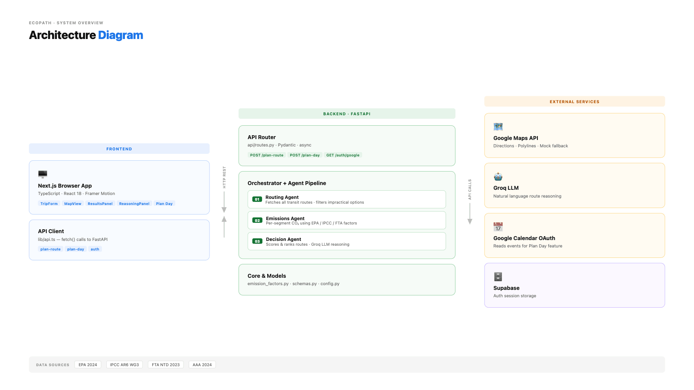
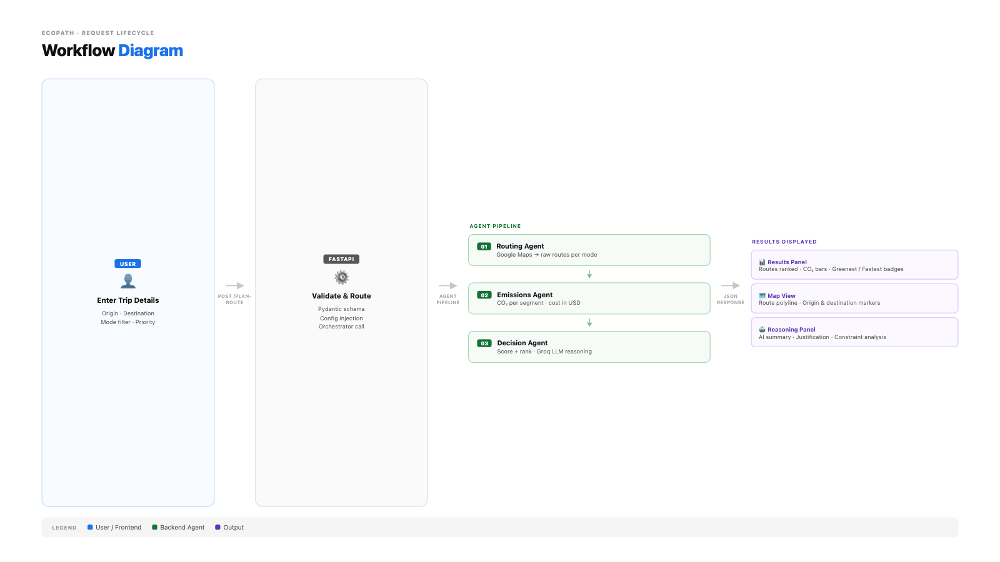
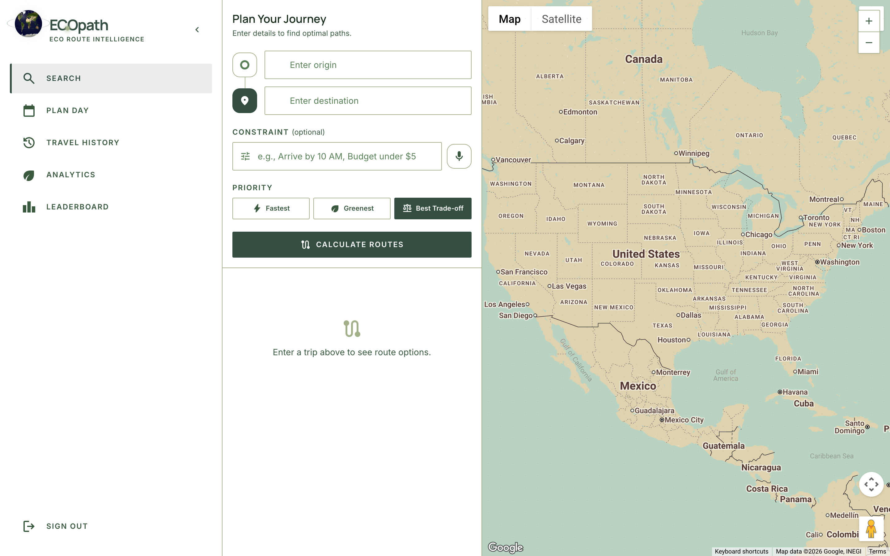
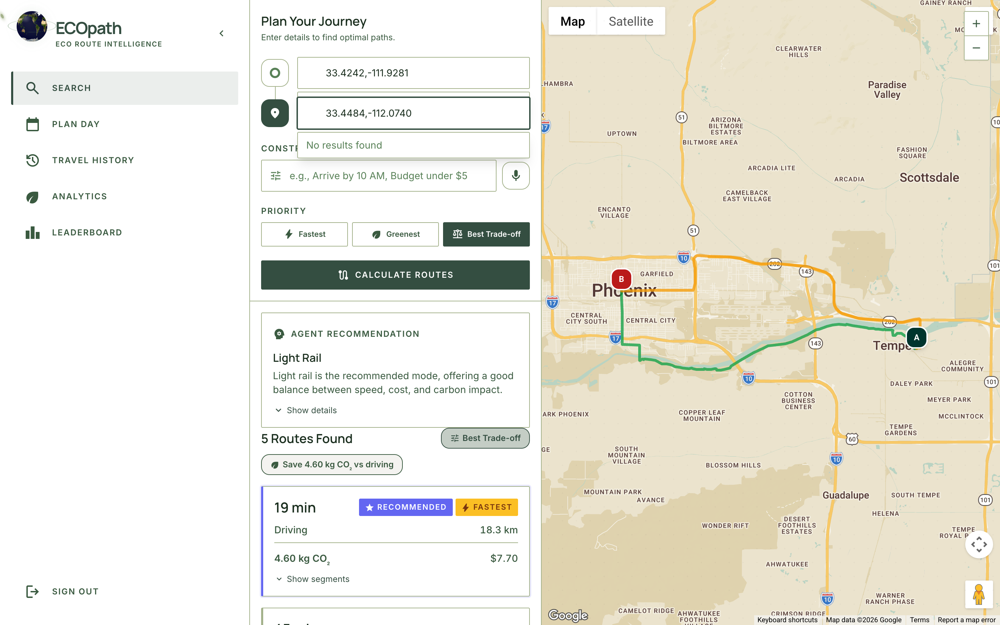
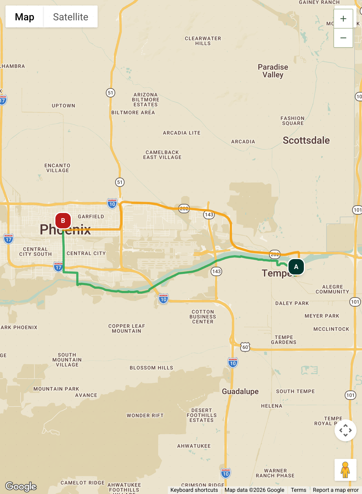
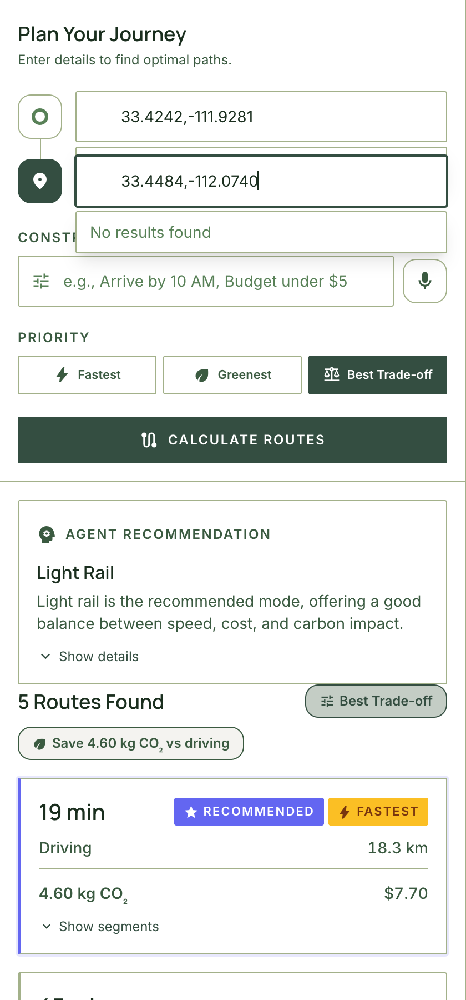
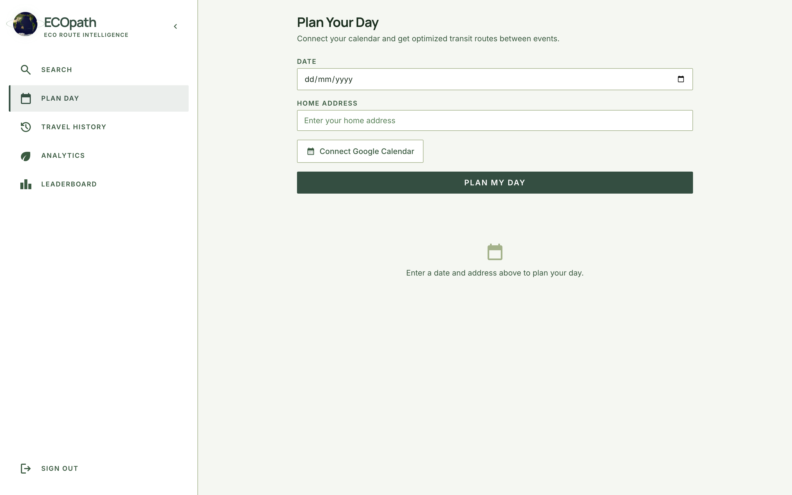
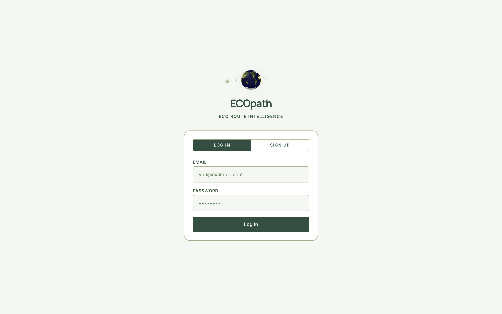

<div align="center">

# ECOpath
### Carbon-Aware, Agentic, Multi-Modal Route Planner

**Compare every way to get from A to B — by carbon, time, and cost — backed by an LLM reasoning agent and verifiable EPA / IPCC / FTA data.**

[](https://kiro.dev)
[](https://fastapi.tiangolo.com)
[](https://nextjs.org)
[](https://groq.com)
[](https://developers.google.com/maps)
[](https://supabase.com)
[](https://python.org)
[](https://typescriptlang.org)

`Agentic AI` · `Kiro Hooks` · `Kiro Steering` · `Kiro Specs` · `MCP-style Pipelines` · `Google Maps API` · `Groq Llama` · `Google Calendar OAuth` · `Supabase`

</div>

---

## Why ECOpath?

> Every gram of CO₂ in this app is traceable to a published dataset.
> Every recommendation is justified in plain English by a real LLM.
> Every route option is computed live — not faked, not hardcoded.

Most map apps will tell you the *fastest* way somewhere. ECOpath tells you the **greenest, cheapest, and fastest** options side-by-side — with a natural-language recommendation that respects your actual constraints (`"I need to be there by 10 AM"`, `"keep it under $5"`, `"I care about emissions"`).

It is built around a **three-stage agentic pipeline** with strict architectural boundaries — a Routing Agent fetches data, an Emissions Agent computes physics, and a Decision Agent reasons. No single agent reaches around the others.

---

## Architecture Diagram

> Save the architecture image you exported as `docs/diagrams/architecture.png` to render here.



```
┌────────────────┐        ┌──────────────────────────────────────┐        ┌────────────────────────┐
│   FRONTEND     │        │           BACKEND · FASTAPI         │        │   EXTERNAL SERVICES   │
│  Next.js 14    │  HTTP  │  ┌────────────────────────────────┐  │  API   │  · Google Maps API    │
│  React 18      │ ◄────► │  │  API Router (api/routes.py)    │  │ ◄────► │  · Groq LLM (Llama)   │
│  TypeScript    │  REST  │  │  POST /plan-route              │  │ CALLS  │  · Google Calendar    │
│  Framer Motion │        │  │  POST /plan-day                │  │        │  · Supabase Auth      │
│  Tailwind      │        │  │  GET  /auth/google             │  │        └────────────────────────┘
│                │        │  └────────────────────────────────┘  │
│  · TripForm    │        │                  │                   │
│  · MapView     │        │                  ▼                   │
│  · ResultsPanel│        │  ┌────────────────────────────────┐  │
│  · Reasoning   │        │  │  Orchestrator + Agent Pipeline │  │
│  · Plan Day    │        │  │  ① Routing Agent               │  │
│                │        │  │  ② Emissions Agent             │  │
│                │        │  │  ③ Decision Agent (Groq Llama) │  │
│                │        │  └────────────────────────────────┘  │
│                │        │                                      │
│                │        │  Core: emission_factors · schemas    │
│                │        │  Sources: EPA · IPCC · FTA · AAA     │
└────────────────┘        └──────────────────────────────────────┘
```

---

## Workflow Diagram

> Save the workflow image you exported as `docs/diagrams/workflow.png` to render here.



```
USER                 FASTAPI               AGENT PIPELINE                                   RESULTS
────                 ───────               ──────────────                                   ───────

Enter Trip           Validate &            ① Routing Agent                                  Results Panel
Details        ─►    Route          ─►        Google Maps → raw routes per mode      ─►     · Routes ranked
· Origin             · Pydantic                       │                                       · CO₂ bars
· Destination        · Config                         ▼                                       · Greenest /
· Mode filter        · Orchestrator        ② Emissions Agent                                    Fastest badges
· Priority           call                     CO₂ per segment · cost in USD          ─►     Map View
                                                      │                                       · Polyline
                                                      ▼                                       · Markers
                                           ③ Decision Agent                          ─►     Reasoning Panel
                                              Score + rank · Groq LLM reasoning               · AI summary
                                                                                              · Justification
                                                                                              · Constraint
                                                                                                analysis
```

---

## Screenshots

> Drop your screenshots into `docs/screenshots/` with the filenames below — they will render automatically.

<table>
<tr>
<td width="50%" align="center">
  <b>Home — Trip Planner</b><br/>
  
  <sub>TripForm · ReasoningPanel · ResultsPanel · MapView</sub>
</td>
<td width="50%" align="center">
  <b>Route Comparison Results</b><br/>
  
  <sub>Ranked routes with CO₂ bars and Greenest / Fastest badges</sub>
</td>
</tr>
<tr>
<td width="50%" align="center">
  <b>Map View — Live Polyline</b><br/>
  
  <sub>Custom warm-paper Google Map style with origin/destination markers</sub>
</td>
<td width="50%" align="center">
  <b>AI Reasoning Panel</b><br/>
  
  <sub>Groq Llama justification + constraint analysis</sub>
</td>
</tr>
<tr>
<td width="50%" align="center">
  <b>Plan Day — Calendar Integration</b><br/>
  
  <sub>Google Calendar OAuth + transit windows between events</sub>
</td>
<td width="50%" align="center">
  <b>Analytics & Travel History</b><br/>
  
  <sub>Emissions saved over time · per-mode breakdown</sub>
</td>
</tr>
</table>

---

## Key Features

| | Feature | Detail |
|---|---|---|
| **🧠** | **Agentic AI Pipeline** | Three specialized agents (Routing · Emissions · Decision) with one-direction dependencies and Pydantic-typed contracts between every stage. |
| **🦙** | **LLM-Powered Reasoning** | `llama-3.1-8b-instant` via Groq's OpenAI-compatible API generates a plain-English summary, full justification, and constraint analysis for every recommendation. |
| **🗺️** | **Live Google Maps Routing** | Backend hits `routes.googleapis.com/directions/v2:computeRoutes` for real polylines and durations. Mock router available for offline dev. |
| **📅** | **Google Calendar OAuth + Plan Day** | Connect your calendar, pick a date, and ECOpath schedules every transit window between your events with the greenest viable mode. |
| **📊** | **Verifiable Carbon Math** | Every emission factor cites EPA 2024, IPCC AR6 WG3, FTA NTD 2023, or AAA 2024 — *no synthetic numbers ever ship*. |
| **🎯** | **Constraint Override** | Type `"under $5"` or `"arrive in 20 minutes"` and the LLM can override the deterministic scoring engine if the constraint demands it. |
| **⚡** | **Multi-Segment Transit** | Bus / rail routes are decomposed into `walk → transit → walk` segments, each with its own emission factor and cost. |
| **🪝** | **Kiro Hooks** | Three live hooks auto-update API docs, validate emission-factor citations on save, and summarize agent runs. |
| **🧭** | **Kiro Steering** | Hard-rule policies (`agent-architecture.md`, `api-contract.md`, `emission-factors-policy.md`) keep the AI agent from drifting. |
| **📐** | **Spec-Driven Development** | Every feature ships with `requirements.md`, `design.md`, and `tasks.md` under `.kiro/specs/` — not just code. |
| **🛡️** | **Deterministic Fallbacks** | Live Google Routes down? → mock router. Groq down? → weighted-score fallback (40 % CO₂ · 35 % time · 25 % cost). The pipeline never returns 500. |
| **🎨** | **Buttery Frontend** | Next.js 14 App Router, React 18, TypeScript 5, Tailwind, Framer Motion entrance animations, custom warm-paper map style, animated Earth globe. |

---

## Agentic AI Architecture

ECOpath is an **agentic system** with strict layering. The orchestrator (`backend/agents/orchestrator.py`) is the only file that knows about all three agents — every other module talks to exactly one neighbour.

### Stage 1 — Routing Agent · `agents/routing_agent.py`
- **Job:** fetch viable routes across the requested modes from a routing provider (live Google Routes API or mock fallback).
- **Allowed:** filter geometrically impractical routes (>8 km walks, >25 km bike rides), set default mode lists.
- **Forbidden:** computing emissions, computing cost, ranking, recommending. *The routing agent does not know what a gram of CO₂ is.*

### Stage 2 — Emissions Agent · `agents/emissions_agent.py`
- **Job:** apply per-segment emission and cost factors from `core/emission_factors.py` and produce a fully analysed `RouteOption` per route.
- **Allowed:** the `find_greenest / find_fastest / find_cheapest / savings_vs_driving` extremum helpers (deterministic projections, not recommendations).
- **Forbidden:** calling LLMs, ranking by composite score, generating prose. If you find yourself writing English here, it belongs in the Decision Agent.

### Stage 3 — Decision Agent · `agents/decision_agent.py`
- **Job:** produce an `AgentReasoning` (recommended_mode, summary, justification, optional constraint_analysis) given the analysed options and an optional user constraint.
- **Allowed:** call **Groq Llama-3.1-8b-instant** via the OpenAI-compatible client; fall back to the deterministic weighted-score function when no API key is present or on error.
- **Forbidden:** fetching new data, recomputing emissions, mutating route options. *The decision agent reasons over what stages 1 & 2 produced — it never reaches around them.*

> 📖 The full architectural contract lives in [`.kiro/steering/agent-architecture.md`](.kiro/steering/agent-architecture.md). It is treated as a **hard rule** by every code change.

---

## Tech Stack

| Layer | Tools |
|-------|-------|
| **Frontend** | Next.js 14 (App Router) · React 18 · TypeScript 5 · Tailwind CSS · Framer Motion · `@vis.gl/react-google-maps` · Recharts · `@supabase/supabase-js` |
| **Backend** | FastAPI · Pydantic v2 · Pydantic Settings · `httpx` (async) · `openai` SDK (Groq-compatible) · uvicorn |
| **AI / LLM** | Groq Cloud · Llama 3.1 8B Instant · OpenAI-compatible chat completions |
| **Maps & Calendar** | Google Maps Routes API v2 · Google Calendar API v3 · Google OAuth2 |
| **Auth Storage** | Supabase (frontend session) · in-memory token store (calendar OAuth) |
| **Testing** | pytest · Hypothesis (property-based) · Jest · React Testing Library · Vitest |
| **Dev Workflow** | **Kiro AI** (hooks · steering · specs) · MCP-compatible agent boundaries · GitHub · Vercel-ready |

---

## Kiro Integration — Hooks · Steering · Specs · MCP

ECOpath was built end-to-end with [Kiro](https://kiro.dev), Anthropic-aligned spec-driven AI tooling. Kiro is **first-class infrastructure** in this repo, not a side script.

### 🪝 Hooks — `/.kiro/hooks/`
Hooks are JSON files that fire on file events and dispatch an instruction to the agent. ECOpath ships three live hooks:

| Hook | Trigger | What it does |
|------|---------|--------------|
| [`emission-source-check.kiro.hook`](.kiro/hooks/emission-source-check.kiro.hook) | On save of `backend/core/emission_factors.py` | Reads the file and validates that **every** `EmissionFactor` and `CostFactor` has a non-empty `source` field. Reports any missing citations — *never lets a synthetic number through*. |
| [`api-routes-docs-tests.kiro.hook`](.kiro/hooks/api-routes-docs-tests.kiro.hook) | On save of `backend/api/routes.py` | Auto-updates the API section of the README and adds matching pytest cases in `backend/tests/test_api.py`. |
| [`agent-stop-summary.kiro.hook`](.kiro/hooks/agent-stop-summary.kiro.hook) | On agent stop | Emits a three-section summary: files changed · why they changed · exact shell commands to verify. |

### 🧭 Steering — `/.kiro/steering/`
Steering files are markdown policies the AI agent must follow. ECOpath has three hard-rule documents that govern code:

- [`agent-architecture.md`](.kiro/steering/agent-architecture.md) — the three-stage pipeline contract, dependency direction, fallback requirements, and rules for adding a fourth agent.
- [`api-contract.md`](.kiro/steering/api-contract.md) — Pydantic ↔ TypeScript drift prevention, `snake_case` wire format, error-shape contract, versioned `/api/v1/` prefix.
- [`emission-factors-policy.md`](.kiro/steering/emission-factors-policy.md) — approved primary sources (EPA · IPCC · FTA · AAA), banned strings (`"estimated"`, `"approx"`, `"TBD"`), unit fixity (`g CO₂e/pkm`), and the "no synthetic numbers" rule.

### 📐 Specs — `/.kiro/specs/`
Every feature lives as a triplet — `requirements.md`, `design.md`, `tasks.md` — before code is written:

```
.kiro/specs/
├── core-route-mvp/                    Phase 1.1
├── agentic-reasoning-layer/           Phase 1.2
├── schedule-orchestration/            Phase 1.3
├── frontend/                          Phase 1.4
├── backend-frontend-integration/
├── client-interface/
├── priority-route-recommendation/
├── constraint-system-prompt/
├── constraint-override-recommendation/
├── location-autocomplete/
├── route-path-drawing-fix/
├── mic-stream-not-released/
├── selected-modes-reference-error/
└── ...
```

### 🔌 MCP-style Boundaries
Each agent exposes a single async entry point with a typed Pydantic input/output — the same shape MCP servers use to expose tools to a host LLM. The Decision Agent's Groq client is OpenAI-compatible, meaning the entire pipeline could be wrapped as an MCP server with minimal glue.

---

## Verifiable Emission Factors

> Every number cites a real, public dataset. No estimates. No "approx". No LLM-generated factors.

| Mode | g CO₂e / pkm | USD base | USD / km | Source |
|------|------:|------:|------:|--------|
| Driving (solo) | **251** | 0.00 | 0.42 | EPA 2024 — avg passenger vehicle, single occupancy |
| Carpool (2) | 126 | 0.00 | 0.21 | EPA 2024 / 2 occupants |
| Carpool (4) | 63 | 0.00 | 0.105 | EPA 2024 / 4 occupants |
| Bus | 55 | 2.50 | 0.00 | FTA NTD 2023 — urban bus passenger-mile avg |
| Light Rail | 22 | 2.00 | 0.22 | FTA NTD 2023 — light rail passenger-mile avg |
| Subway | 17 | 2.90 | 0.00 | FTA NTD 2023 — heavy rail passenger-mile avg |
| Commuter Rail | 35 | 3.00 | 0.18 | FTA NTD 2023 — commuter rail passenger-mile avg |
| E-Scooter | 6 | 1.00 | 0.25 | IPCC AR6 WG3 Ch. 10 — electric micromobility |
| Walking | 0 | 0.00 | 0.00 | Zero direct emissions |
| Bicycling | 0 | 0.00 | 0.00 | Zero direct emissions |
| Rideshare | 300 | 3.00 | 1.20 | EPA 2024 + ~20 % deadhead premium |

The full table with `notes` and conversion math lives in [`backend/core/emission_factors.py`](backend/core/emission_factors.py).

---

## API Reference

All endpoints are versioned under `/api/v1`. Every response uses a Pydantic `response_model`.

| Method | Path | Body / Query | Response |
|--------|------|--------------|----------|
| `GET`  | `/api/v1/health` | — | `HealthResponse` |
| `POST` | `/api/v1/plan-route` | `RouteRequest` | `RouteComparison` |
| `GET`  | `/api/v1/auth/google` | — | `AuthUrlResponse` |
| `GET`  | `/api/v1/auth/callback` | `?code&state` | redirect / `AuthCallbackResponse` |
| `POST` | `/api/v1/plan-day` | `DayPlanRequest` | `DayPlanResponse` |

### Example — single route

```bash
curl -X POST http://localhost:8000/api/v1/plan-route \
  -H "Content-Type: application/json" \
  -d '{
        "origin": "33.4242,-111.9281",
        "destination": "33.4484,-112.0740",
        "constraint": "Keep it under $5 and greener than driving",
        "priority": "best_tradeoff"
      }'
```

### Example response (truncated)

```json
{
  "origin": "33.4242,-111.9281",
  "destination": "33.4484,-112.0740",
  "greenest": { "mode": "bicycling", "total_emissions_kg": 0.0 },
  "fastest":  { "mode": "driving",   "total_duration_min": 23.9 },
  "savings_vs_driving_kg": 4.503,
  "reasoning": {
    "recommended_mode": "light_rail",
    "summary": "Take light rail — 32 min, 290g CO₂, $4.20.",
    "justification": "Driving is fastest at 24 min but emits 4.7kg of CO₂...",
    "constraint_analysis": "Light rail satisfies your <$5 budget while emitting 94% less CO₂ than driving.",
    "constraint_override": false
  },
  "options": [ ... ],
  "scored_routes": [ ... ]
}
```

> Interactive OpenAPI docs auto-generated at <http://localhost:8000/docs> once the backend is running.

---

## 🚀 Local Setup — Step-by-Step Walkthrough

Follow these steps from a clean machine to a fully running ECOpath instance with live Google Maps, Groq reasoning, and Calendar OAuth.

### 0 · Prerequisites

| Tool | Min version | Check |
|------|------------|-------|
| Python | 3.11 | `python3 --version` |
| Node.js | 18 LTS or 20 | `node --version` |
| npm | 9 | `npm --version` |
| Git | any recent | `git --version` |

You will also need **API keys** for the live experience (everything still works in mock mode without them):

- **Google Maps API key** with Routes API + Places API enabled — <https://console.cloud.google.com/google/maps-apis>
- **Google OAuth Client ID + Secret** for Calendar — <https://console.cloud.google.com/apis/credentials>
- **Groq API key** — <https://console.groq.com/keys>
- *(optional)* **Supabase project** (URL + anon key) — <https://supabase.com>

### 1 · Clone the repository

```bash
git clone https://github.com/maulik-jadav/Kiro-spark-challenge.git
cd Kiro-spark-challenge
```

### 2 · Backend — FastAPI + Agent Pipeline

```bash
cd backend

# create an isolated virtual environment
python3 -m venv .venv
source .venv/bin/activate          # Windows: .venv\Scripts\activate

# install Python dependencies
pip install --upgrade pip
pip install -r requirements.txt
```

Create `backend/.env` (the file is git-ignored):

```env
# routing mode: "live" hits Google Maps Routes API, "mock" uses the local mock router
ROUTING_MODE=live

# Google Maps Routes API key (Routes API must be enabled on the project)
GOOGLE_MAPS_API_KEY=your_google_maps_api_key

# Groq — used by the Decision Agent
GROQ_API_KEY=your_groq_api_key

# Google Calendar OAuth (optional — only needed for the /plan-day flow)
GOOGLE_CLIENT_ID=your_google_client_id
GOOGLE_CLIENT_SECRET=your_google_client_secret
GOOGLE_REDIRECT_URI=http://localhost:8000/api/v1/auth/callback

# server
DEBUG=true
```

Start the backend:

```bash
python main.py
```

You should see:

```
INFO:     Uvicorn running on http://0.0.0.0:8000 (Press CTRL+C to quit)
INFO:     Application startup complete.
```

Quick sanity checks:

```bash
curl http://localhost:8000/api/v1/health
# → {"status":"ok"}

open http://localhost:8000/docs        # interactive Swagger UI
```

### 3 · Frontend — Next.js 14

In a **new terminal** (keep the backend running):

```bash
cd frontend
npm install
```

Create `frontend/.env.local`:

```env
# Google Maps JavaScript API key (browser-side — Maps JavaScript API + Places API must be enabled)
NEXT_PUBLIC_GOOGLE_MAPS_API_KEY=your_google_maps_browser_key

# Custom Map ID for the warm-paper style map (optional)
NEXT_PUBLIC_GOOGLE_MAP_ID=your_google_map_id

# Supabase (optional — only needed for auth + history persistence)
NEXT_PUBLIC_SUPABASE_URL=https://your-project.supabase.co
NEXT_PUBLIC_SUPABASE_ANON_KEY=your_supabase_anon_key
```

Start the frontend dev server:

```bash
npm run dev
```

Open <http://localhost:3000> — ECOpath should load with the animated Earth globe and the trip form.

### 4 · Try it end-to-end

1. **Single route** — type two locations into the trip form, hit **Plan Route**, and watch the Decision Agent's reasoning appear alongside ranked options.
2. **Add a constraint** — try `"keep it under $4"` or `"I need to be there in 20 minutes"` and confirm the AI override flag in the response.
3. **Plan Day** — open <http://localhost:3000/plan-day>, click **Connect Google Calendar**, complete the OAuth flow, then plan a date with home address pre-filled.

### 5 · Run the tests

Backend:

```bash
cd backend
pytest -v
```

Tests cover every agent, the orchestrator, the day-plan builder, the calendar client, the maps client, the emission factors table, and the API. Property-based tests via Hypothesis are included.

Frontend:

```bash
cd frontend
npm test                     # Jest + React Testing Library
```

### 6 · Production build (optional)

```bash
# frontend
cd frontend
npm run build && npm start

# backend (without --reload)
cd backend
uvicorn main:app --host 0.0.0.0 --port 8000 --workers 4
```

A `vercel.json` is included for one-click deployment of the frontend.

---

## Project Structure

```
ECOpath/
├── backend/                            FastAPI · Python 3.11
│   ├── agents/
│   │   ├── orchestrator.py             ⇄ runs the 3-stage pipeline + plan_day()
│   │   ├── routing_agent.py            ① fetches multi-modal routes
│   │   ├── emissions_agent.py          ② per-segment CO₂ + cost
│   │   └── decision_agent.py           ③ Groq Llama reasoning + fallback
│   ├── api/
│   │   └── routes.py                   POST /plan-route · POST /plan-day · OAuth
│   ├── core/
│   │   ├── config.py                   Pydantic-settings · .env loader
│   │   ├── emission_factors.py         EPA · IPCC · FTA · AAA tables
│   │   ├── scoring_engine.py           weighted Pareto + practicality penalties
│   │   ├── candidate_generator.py
│   │   └── emissions_converter.py
│   ├── models/
│   │   └── schemas.py                  single Pydantic source of truth
│   ├── services/
│   │   ├── maps_client.py              live Google Routes + mock haversine
│   │   └── calendar_client.py          Google OAuth2 + Calendar v3 (raw httpx)
│   ├── tests/                          pytest · Hypothesis · async
│   ├── main.py                         FastAPI factory + uvicorn entry
│   └── requirements.txt
│
├── frontend/                           Next.js 14 · React 18 · TS 5
│   └── src/
│       ├── app/
│       │   ├── page.tsx                Trip planner home
│       │   ├── plan-day/page.tsx       Calendar-aware day planner
│       │   ├── analytics/page.tsx
│       │   ├── leaderboard/page.tsx
│       │   ├── travel-history/page.tsx
│       │   ├── login/page.tsx
│       │   ├── layout.tsx
│       │   └── globals.css
│       ├── components/
│       │   ├── TripForm.tsx
│       │   ├── MapView.tsx             custom warm-paper Google Map
│       │   ├── ResultsPanel.tsx
│       │   ├── ReasoningPanel.tsx
│       │   ├── RouteCard.tsx
│       │   ├── ConstraintInput.tsx
│       │   ├── PlaceAutocompleteInput.tsx
│       │   ├── EarthGlobe.tsx          animated WebGL globe
│       │   ├── SideNav.tsx
│       │   └── AuthGuard.tsx
│       ├── lib/
│       │   ├── api.ts                  fetch wrappers + ApiError class
│       │   └── supabase.ts
│       └── types/
│           └── api.ts                  mirrors backend/models/schemas.py
│
├── supabase/                           SQL migrations
├── supabase_setup.sql
├── supabase_update.sql
│
├── .kiro/                              ⇄ Spec-driven AI workflow
│   ├── hooks/                          3 active Kiro hooks
│   ├── steering/                       3 hard-rule policies
│   └── specs/                          14+ feature specs
│
├── docs/
│   ├── diagrams/                       architecture.png · workflow.png
│   └── screenshots/                    home · results · map · reasoning · plan-day · analytics
│
├── vercel.json
└── README.md
```

---

## Roadmap

| Phase | Status | What |
|-------|:-----:|------|
| **1.1** Core emissions engine + single-route MVP | ✅ | Routing + Emissions agents, EPA/IPCC/FTA tables, FastAPI + pytest |
| **1.2** Agentic reasoning layer | ✅ | Decision Agent, Groq Llama 3.1, deterministic fallback, constraint override |
| **1.3** Calendar integration + day plan | ✅ | Google OAuth2, Calendar v3, transit-window builder, `plan_day()` orchestration |
| **1.4** Next.js frontend + full FE↔BE integration | ✅ | App Router, Framer Motion, Google Maps, Plan Day UI, ReasoningPanel, MapView |
| **1.5** Analytics + Travel History + Leaderboard | 🚧 | Supabase persistence, Recharts dashboards, gamified savings |
| **1.6** Voice constraints + multilingual UI | 🔜 | Web Speech API mic input, locale-aware emission units |
| **2.0** MCP server wrapper | 🔜 | Expose the agent pipeline as a standalone MCP tool server for IDE integrations |

---

## Testing

| Suite | Framework | Run |
|-------|-----------|-----|
| Backend agents · orchestrator · API · maps · calendar | `pytest` + Hypothesis | `cd backend && pytest -v` |
| Frontend bug-regression · constraint preservation | Jest + RTL | `cd frontend && npm test` |
| Integration tests (live APIs) | `pytest -m integration` | requires real keys, opt-in |

The backend test suite mocks Google Routes and Groq by default so it runs offline and deterministically. Live tests are explicitly tagged `@pytest.mark.integration`.

---

## Contributing

Any change touching one of these files will trigger an automated Kiro hook — please review the hook output before committing:

- `backend/api/routes.py` → README + tests auto-update
- `backend/core/emission_factors.py` → source-citation validator runs

When adding a new transit mode, follow the checklist in [`emission-factors-policy.md`](.kiro/steering/emission-factors-policy.md). When adding a new pipeline stage, follow the checklist in [`agent-architecture.md`](.kiro/steering/agent-architecture.md).

---

## Acknowledgements & Data Sources

- **U.S. Environmental Protection Agency** — *Inventory of U.S. Greenhouse Gas Emissions and Sinks* (2024)
- **IPCC AR6 Working Group III** — *Chapter 10: Transport* (2022)
- **U.S. Federal Transit Administration** — *National Transit Database* (2023)
- **AAA** — *Your Driving Costs* (2024)
- **Groq** — fast LLM inference for the Decision Agent
- **Google Maps Platform** — Routes API + Calendar API + Places API
- **Kiro** — spec-driven AI dev workflow (hooks · steering · specs · MCP)
- **Anthropic Claude** — agent collaborator throughout the build

---

<div align="center">

Built for the **Kiro Spark Challenge** ⚡

`Agentic AI · Hooks · Steering · Specs · MCP · Google Maps · Groq · Llama · FastAPI · Next.js`

</div>
